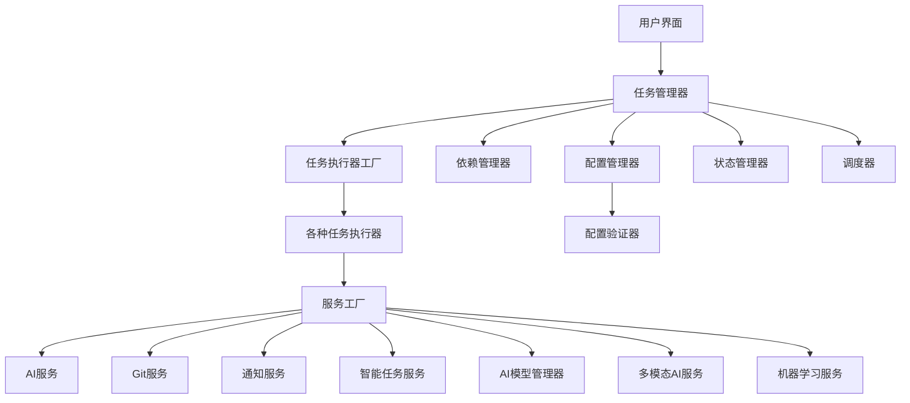

# AI自动化任务执行系统 - 完整功能文档

## 目录
1. [系统概述](#系统概述)
2. [核心功能模块](#核心功能模块)
3. [技术架构](#技术架构)
4. [配置说明](#配置说明)
5. [使用指南](#使用指南)
6. [最佳实践](#最佳实践)
7. [故障排除](#故障排除)

---

## 系统概述

AI自动化任务执行系统是一个功能强大的AI任务编排和执行框架，支持多种类型的AI任务自动化处理，包括代码生成、文档生成、代码审查、需求分析等。系统采用模块化设计，具备高度的可扩展性和可配置性。

### 主要特性
- **多任务类型支持**：支持代码生成、文档生成、代码审查、需求分析等多种任务类型
- **智能任务管理**：基于AI的智能任务生成和参数优化
- **依赖管理**：支持复杂的任务依赖关系和并行执行优化
- **AI模型管理**：多模型版本控制和自动切换
- **多模态支持**：支持图像、文档等多种媒体类型处理
- **机器学习集成**：预测模型、异常检测、A/B测试等ML功能
- **配置管理**：严格的配置验证和管理机制

---

## 核心功能模块

### 1. 任务依赖管理

#### 功能描述
提供强大的任务编排能力，支持复杂的任务依赖关系、资源管理和并行执行优化。

#### 核心功能
- **依赖图构建**：支持任务间的依赖关系定义
- **并行执行优化**：基于依赖图优化执行顺序
- **条件触发**：支持基于其他任务结果的条件触发
- **资源竞争控制**：避免资源冲突的任务调度

#### 依赖类型
- **必需依赖 (Required)**：任务必须等待依赖任务完成后才能执行
- **可选依赖 (Optional)**：任务可以等待依赖任务完成，但即使依赖任务失败也会执行
- **条件依赖 (Conditional)**：任务根据条件函数的结果决定是否执行

#### 使用示例
```yaml
# 任务依赖配置
dependencies:
  - task_id: "data_preprocessing"
    type: "required"
    timeout: 3600
  - task_id: "model_deployment"
    type: "optional"
    timeout: 1800
```

### 2. 配置管理增强

#### 功能描述
提供严格的配置验证和管理机制，确保配置文件的正确性和一致性。

#### 核心功能
- **类型验证**：严格验证配置字段的数据类型
- **值范围验证**：检查配置值的合理性和范围
- **结构验证**：验证配置文件的整体结构
- **字段验证**：检查必需字段和未知字段
- **自定义验证器**：支持添加自定义验证规则

#### 验证规则
- **任务类型**：coding, review, doc, requirement_review, custom, multimodal, ml_integration, smart_generation
- **调度类型**：cron, interval, once, manual
- **依赖类型**：required, optional, conditional
- **资源类型**：cpu, memory, disk, network, gpu

### 3. 智能任务生成

#### 功能描述
基于AI的智能任务生成和优化功能，能够根据自然语言描述自动生成任务配置。

#### 核心功能
- **自然语言任务定义**：用自然语言描述任务需求
- **任务模板推荐**：基于历史数据推荐任务模板
- **智能参数优化**：自动优化任务参数
- **任务效果预测**：预测任务执行效果

#### 使用示例
```yaml
# 智能任务生成配置
intelligent_task:
  description: "请为我生成一个用户管理系统的API文档生成任务，包括用户注册、登录、信息修改等功能"
  context:
    project_type: "web_application"
    technology_stack: ["Spring Boot", "MySQL", "Redis"]
    output_format: "markdown"
```

### 4. AI模型管理

#### 功能描述
提供完整的AI模型版本控制、自动模型切换和模型微调能力。

#### 核心功能
- **模型版本控制**：支持AI模型版本管理
- **自动模型切换**：根据性能自动切换最佳模型
- **模型微调**：支持模型微调和优化

#### 模型类型支持
- **文本生成**：TEXT_GENERATION
- **代码生成**：CODE_GENERATION
- **文本分析**：TEXT_ANALYSIS
- **多模态**：MULTIMODAL
- **嵌入模型**：EMBEDDING

#### 使用示例
```yaml
# AI模型管理配置
ai_model_management:
  operation: "register_model"
  model_config:
    model_name: "claude-3-sonnet"
    model_type: "text_generation"
    version: "20240229"
    provider: "anthropic"
    api_key: "${ANTHROPIC_API_KEY}"
    parameters:
      max_tokens: 4000
      temperature: 0.7
    set_active: true
```

### 5. 多模态AI支持

#### 功能描述
提供强大的多媒体内容处理能力，包括图像处理、文档解析、文本分析等。

#### 核心功能
- **图像处理**：图像识别、分析、文字提取、图像增强、特征提取
- **文档解析**：PDF、Word文档解析，文本提取、段落分析、表格提取
- **文本处理**：文本分析、关键信息提取、智能摘要、内容分类

#### 媒体类型支持
- **图像**：IMAGE
- **PDF文档**：PDF
- **Word文档**：WORD
- **文本文件**：TEXT
- **音频文件**：AUDIO
- **视频文件**：VIDEO

#### 使用示例
```yaml
# 多模态AI支持配置
multimodal_ai:
  operation: "process_single_file"
  file_path: "./test_files/sample_image.jpg"
  processing_type: "analysis"
  options:
    use_ai_analysis: true
    max_tokens: 1000
    temperature: 0.3
    prompt: "请分析这张图片的内容"
```

### 6. 机器学习集成

#### 功能描述
集成机器学习功能，提供预测模型、异常检测、智能调度和A/B测试能力。

#### 核心功能
- **预测模型**：预测任务执行时间和成功率
- **异常检测**：自动检测异常任务
- **智能调度**：基于历史数据的智能调度
- **A/B测试**：支持A/B测试框架

#### 使用示例
```yaml
# 机器学习集成配置
machine_learning:
  operation: "predict_task"
  task_config:
    type: "coding"
    priority: 7
    schedule:
      type: "cron"
      expression: "0 9 * * 1-5"
    dependencies:
      - task_id: "data_preparation"
        type: "required"
    resources:
      cpu: 2
      memory: 2048
      disk: 500
```

---

## 技术架构

### 系统架构图



### 核心组件

#### 1. 任务管理器 (TaskManager)
- 负责任务的调度、执行和状态管理
- 集成依赖管理器、配置管理器、状态管理器
- 支持并发任务执行

#### 2. 服务工厂 (ServiceFactory)
- 统一管理各种服务的创建
- 支持服务缓存和依赖注入
- 提供服务的生命周期管理

#### 3. 任务执行器工厂 (TaskExecutorFactory)
- 管理所有任务执行器的注册和创建
- 支持动态加载任务执行器
- 提供统一的执行器接口

#### 4. 配置管理器 (ConfigManager)
- 管理全局和任务级配置
- 支持环境变量和配置文件
- 集成配置验证功能

---

## 配置说明

### 全局配置文件 (config/global_config.yaml)

```yaml
# 系统基础配置
name: "AI自动化任务执行系统"
version: "1.0.0"
max_concurrent_tasks: 5

# AI服务配置
ai_services:
  default: "openai"
  openai:
    api_key: "${OPENAI_API_KEY}"
    model: "gpt-4"
    max_tokens: 4000
    temperature: 0.7

# Git配置
git:
  platform: "github"
  token: "${GITHUB_TOKEN}"
  repository: "your-repo"

# 通知配置
notifications:
  email:
    enabled: true
    smtp_server: "smtp.gmail.com"
    smtp_port: 587
    username: "${EMAIL_USERNAME}"
    password: "${EMAIL_PASSWORD}"

# 任务依赖管理配置
dependency_management:
  enabled: true
  max_dependency_depth: 10
  resource_check_interval: 30

# 配置管理增强配置
config_validation:
  enabled: true
  strict_mode: true
  unknown_field_warning: true

# 智能任务生成配置
intelligent_task_generation:
  enabled: true
  optimization_rules:
    coding:
      max_tokens_multiplier: 1.5
      temperature_adjustment: 0.8
      timeout_multiplier: 1.3
      retry_attempts_increase: 1

# AI模型管理配置
ai_model_management:
  enabled: true
  database_path: "./data/ai_models.db"
  models_directory: "./models"
  auto_switch_enabled: true
  auto_switch_threshold: 0.8

# 多模态AI支持配置
multimodal_ai:
  enabled: true
  supported_media_types:
    - "image"
    - "pdf"
    - "word"
    - "text"
  output_directory: "./outputs/multimodal"

# 机器学习集成配置
machine_learning:
  enabled: true
  database_path: "./data/ml_service.db"
  models_directory: "./models"
  prediction:
    min_training_samples: 10
    model_type: "random_forest"
    confidence_threshold: 0.7
```

---

## 使用指南

### 快速开始

#### 1. 安装依赖
```bash
pip install -r requirements.txt
```

#### 2. 配置环境变量
```bash
export OPENAI_API_KEY="your-openai-api-key"
export GITHUB_TOKEN="your-github-token"
export EMAIL_USERNAME="your-email@example.com"
export EMAIL_PASSWORD="your-email-password"
```

#### 3. 创建任务配置
```yaml
# config/tasks/my_task.yaml
task_id: "my_first_task"
name: "我的第一个任务"
type: "coding"
enabled: true
priority: 5

coding:
  prompt: "请生成一个简单的Hello World程序"
  language: "python"
  output_format: "python"
  output_location: "./output"
```

#### 4. 运行任务
```python
from src.core.task_manager import TaskManager
from src.core.config_manager import ConfigManager
from src.core.state_manager import StateManager
from src.services.notify_service import NotifyService

# 初始化组件
config_manager = ConfigManager()
state_manager = StateManager()
notify_service = NotifyService(config_manager.global_config)

# 创建任务管理器
task_manager = TaskManager(config_manager, state_manager, notify_service)

# 启动任务管理器
task_manager.start()

# 提交任务
task_manager.submit_task("my_first_task")
```

---

## 最佳实践

### 1. 任务设计
- **单一职责**：每个任务只负责一个明确的功能
- **合理依赖**：避免过深的依赖链（建议不超过5层）
- **资源控制**：合理配置资源需求，避免资源过度分配
- **错误处理**：为任务配置适当的重试和超时机制

### 2. 配置管理
- **环境变量**：敏感信息使用环境变量，不要硬编码
- **配置验证**：启用严格模式进行配置验证
- **版本控制**：配置文件纳入版本控制
- **备份策略**：定期备份重要配置

### 3. AI服务使用
- **模型选择**：根据任务类型选择合适的AI模型
- **参数调优**：根据任务复杂度调整模型参数
- **成本控制**：监控API调用成本，设置合理的限制
- **性能优化**：使用缓存和批量处理提高效率

---

## 故障排除

### 常见问题

#### 1. 配置验证失败
**问题**：配置文件验证失败，提示字段错误
**解决方案**：
- 检查字段类型是否正确
- 确认必需字段是否存在
- 验证字段值是否在合理范围内
- 检查自定义验证器逻辑

#### 2. 任务依赖循环
**问题**：检测到任务依赖循环
**解决方案**：
- 使用`check_circular_dependencies()`检测循环依赖
- 重新设计依赖关系，避免循环
- 考虑使用可选依赖减少阻塞

#### 3. AI服务调用失败
**问题**：AI服务API调用失败
**解决方案**：
- 检查API密钥是否正确
- 确认网络连接正常
- 验证API配额是否充足
- 检查请求参数格式

#### 4. 机器学习功能不可用
**问题**：机器学习功能无法使用
**解决方案**：
- 安装必需的依赖库：`pip install scikit-learn numpy`
- 检查数据库连接
- 确认模型文件路径正确
- 查看日志中的具体错误信息

### 调试工具

#### 1. 日志分析
```python
import logging

# 设置详细日志
logging.basicConfig(level=logging.DEBUG)

# 查看特定组件的日志
logger = logging.getLogger('src.core.task_manager')
logger.setLevel(logging.DEBUG)
```

#### 2. 状态检查
```python
# 检查任务状态
task_status = task_manager.get_task_status("task_id")
print(f"任务状态: {task_status}")

# 检查依赖关系
dependencies = task_manager.get_task_dependencies("task_id")
print(f"依赖关系: {dependencies}")

# 检查资源状态
resource_status = task_manager.get_resource_status()
print(f"资源状态: {resource_status}")
```

---

## 总结

AI自动化任务执行系统是一个功能完整、架构清晰的AI任务编排和执行框架。通过模块化设计和丰富的功能特性，系统能够满足各种AI任务自动化的需求。

### 核心优势
- **功能完整**：涵盖任务管理、AI服务、机器学习等各个方面
- **架构清晰**：模块化设计，易于理解和扩展
- **配置灵活**：支持多种配置方式和验证机制
- **文档完善**：提供详细的使用文档和最佳实践

### 适用场景
- **代码生成**：自动化生成各种类型的代码
- **文档生成**：自动生成技术文档和说明文档
- **代码审查**：自动化代码质量检查和优化建议
- **需求分析**：AI辅助的需求分析和文档生成
- **数据处理**：多模态数据的智能处理和分析

### 未来扩展
- **更多AI模型支持**：集成更多类型的AI模型
- **更智能的调度**：基于机器学习的智能调度优化
- **更丰富的媒体类型**：支持更多类型的媒体处理
- **更强大的分析能力**：增强数据分析和可视化功能

通过本系统的使用，可以大大提高AI任务的自动化程度，减少人工干预，提高工作效率和质量。
