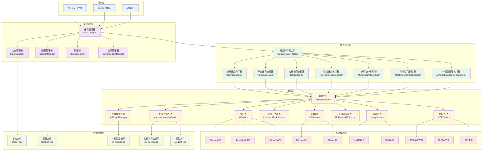
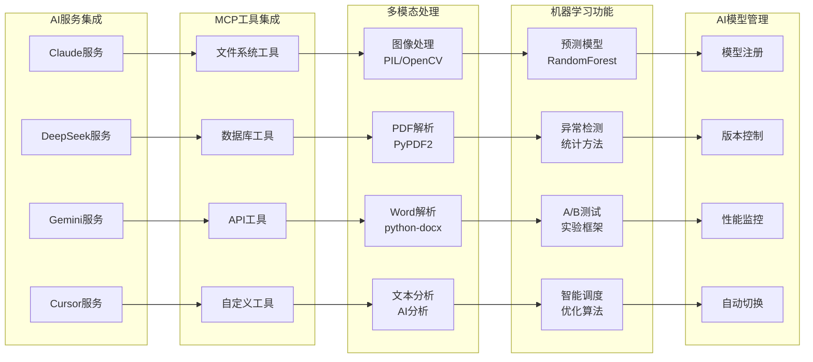
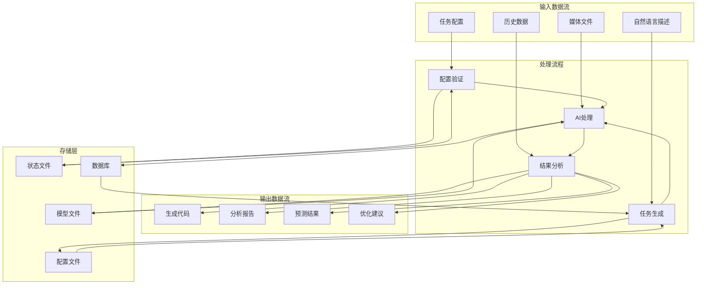
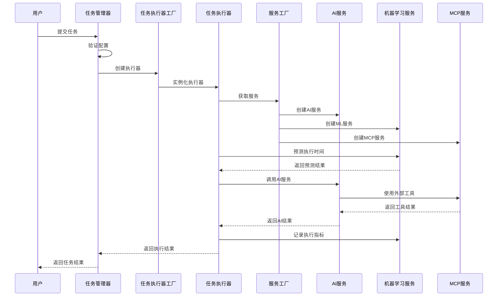
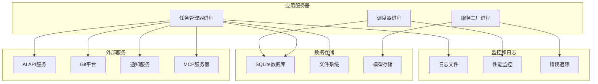
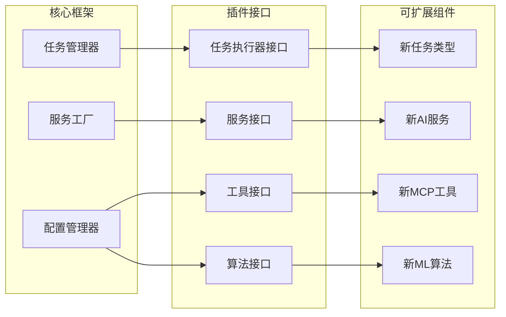

# 自动化AI任务执行系统 - 系统架构图

## 整体架构图

## 服务层详细架构

## 数据流架构

## 组件交互时序图

## 部署架构

## 扩展性架构

这个架构图展示了系统的完整结构，包括：

1. **整体架构图**：展示了从用户层到数据存储层的完整架构
2. **服务层详细架构**：详细展示了各种服务的集成方式
3. **数据流架构**：展示了数据在系统中的流动过程
4. **组件交互时序图**：展示了组件间的交互时序
5. **部署架构**：展示了系统的部署结构
6. **扩展性架构**：展示了系统的扩展能力

通过这些架构图，可以清楚地了解系统的整体设计、组件关系和数据流向。
