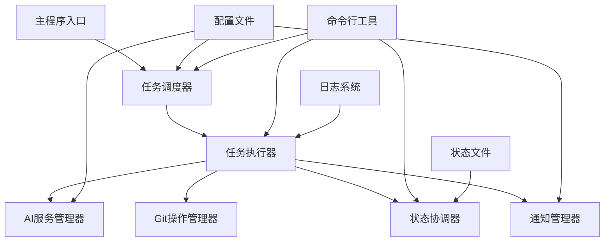

# 自动化AI任务执行系统设计文档

## 📋 系统概览

### 支持的任务类型
本系统支持以下5种任务类型，每种任务都可以独立配置和调度：

1. **🔧 编码任务 (coding)**
   - AI自动生成代码，支持分支创建和Git提交
   - 与走查任务协作，通过状态文件协调执行流程

2. **🔍 走查任务 (review)**
   - AI代码审查，分析代码质量和设计合理性
   - 支持协作模式（与编码任务配合）和独立模式

3. **📚 文档任务 (doc)**
   - AI自动生成Markdown格式文档
   - 支持技术文档、API文档、用户手册等

4. **📋 需求评审任务 (requirement_review)** ⭐ 新增
   - AI分析需求文档与代码实现的一致性
   - 深入分析架构设计、接口定义、数据模型等

5. **⚙️ 自定义任务 (custom)** ⭐ 新增
   - 支持任意场景的AI任务，高度灵活
   - 支持多种输出格式（Markdown、Excel、PPT等）

### 核心特性
- **智能调度**：基于crontab表达式的定时任务执行
- **AI驱动**：支持Claude和DeepSeek等多种AI模型
- **Git集成**：完整的GitHub和GitLab自动化操作
- **状态协调**：智能的任务状态管理和协作机制
- **通知系统**：钉钉机器人实时通知和告警

### 任务类型对比表

| 任务类型 | 主要功能 | 输入来源 | 输出格式 | 协作关系 | 典型应用场景 |
|---------|---------|---------|---------|---------|-------------|
| **编码任务** | AI代码生成 | 需求描述、代码上下文 | 代码文件 | 与走查任务协作 | 功能开发、代码重构 |
| **走查任务** | 代码质量审查 | 代码变更、编码规范 | Markdown报告 | 与编码任务协作 | 代码审查、质量检查 |
| **文档任务** | 文档自动生成 | 代码、需求描述 | Markdown文档 | 独立执行 | 技术文档、API文档 |
| **需求评审** | 需求与代码一致性分析 | 需求文档、代码实现 | Markdown报告 | 独立执行 | 需求验证、架构评审 |
| **自定义任务** | 灵活AI任务 | 自定义输入源 | 多种格式 | 独立执行 | 代码分析、报告生成 |

## 1. 系统架构概述

### 1.1 整体架构


### 1.2 核心组件
- **任务调度器**：基于crontab表达式的定时任务调度，支持5种任务类型，支持优先级和并发控制
- **任务执行器**：执行编码、走查、文档生成、需求评审、自定义任务，支持超时控制和重试机制
- **AI服务管理器**：管理Claude和DeepSeek API调用，支持任务类型特定的参数优化
- **Git操作管理器**：处理GitHub和GitLab操作，支持分支管理和代码提交
- **状态协调器**：协调编码者和走查者的交替执行，管理任务状态转换和状态文件清理
- **通知管理器**：钉钉机器人通知，支持个性化通知模板和多种通知级别
- **配置管理器**：管理全局和任务级配置，支持编码规范、超时时间、重试策略等配置
- **编码规范管理器**：按语言分类管理编码规范文件，支持版本管理和动态加载
- **状态文件管理器**：管理状态文件的生命周期，支持自动清理、归档和备份

## 2. 系统设计

### 2.1 目录结构
```
auto-coder/
├── src/
│   ├── core/                 # 核心模块
│   │   ├── scheduler.py      # 任务调度器
│   │   ├── executor.py       # 任务执行器
│   │   ├── state_manager.py  # 状态协调器
│   │   └── config_manager.py # 配置管理器
│   ├── services/             # 服务层
│   │   ├── ai_service.py     # AI服务管理
│   │   ├── git_service.py    # Git操作服务
│   │   └── notify_service.py # 通知服务
│   ├── tasks/                # 任务类型
│   │   ├── coding_task.py    # 编码任务
│   │   ├── review_task.py    # 走查任务
│   │   ├── doc_task.py       # 文档任务
│   │   ├── requirement_review_task.py  # 需求评审任务
│   │   └── custom_task.py    # 自定义任务
│   ├── utils/                # 工具类
│   │   ├── logger.py         # 日志工具
│   │   ├── file_utils.py     # 文件操作工具
│   │   └── crypto_utils.py   # 加密工具
│   └── cli/                  # 命令行接口
│       └── main.py           # 主程序入口
├── config/                   # 配置文件
│   ├── global_config.yaml    # 全局配置
│   └── tasks/                # 任务配置
├── standards/                # 编码规范文件
│   ├── java_coding_standards.md      # Java编码规范
│   ├── python_coding_standards.md    # Python编码规范
│   ├── frontend_coding_standards.md  # 前端编码规范
│   ├── general_coding_standards.md   # 通用编码规范
│   └── redline_standards.md          # 编码红线规范
├── logs/                     # 日志文件
├── states/                   # 状态文件
├── archives/                 # 归档文件
│   └── states/               # 状态文件归档
├── outputs/                  # 输出文件
│   ├── reviews/              # 代码审查输出
│   ├── docs/                 # 文档生成输出
│   ├── requirement_reviews/  # 需求评审输出
│   └── custom_tasks/         # 自定义任务输出
├── requirements.txt           # 依赖包
├── README.md                 # 使用说明
└── run.py                    # 启动脚本
```

### 2.2 配置文件结构

#### 调度配置格式说明

系统支持两种调度配置格式：

**1. 标准crontab表达式格式（推荐）**
```yaml
schedule:
  type: "cron"
  cron_expressions:
    - "0 9 * * 1-5"      # 周一到周五上午9点
    - "0 18 * * 1-5"     # 周一到周五下午6点
```

**2. 分解的cron字段格式（向后兼容）**
```yaml
schedule:
  type: "cron"
  cron:
    minute: "0"
    hour: "9"
    day: "*"
    month: "*"
    day_of_week: "1-5"
```

**crontab表达式格式说明：**
- 格式：`分钟 小时 日期 月份 星期`
- 字段：`0-59 0-23 1-31 1-12 0-7`（0和7都表示周日）
- 特殊字符：
  - `*`：表示任意值
  - `*/n`：表示每隔n个单位
  - `1-5`：表示范围（1到5）
  - `1,3,5`：表示指定值

#### 全局配置文件 (global_config.yaml)
```yaml
# AI服务配置
ai_services:
  claude:
    api_key: "${CLAUDE_API_KEY}"
    base_url: "https://api.anthropic.com"
    model: "claude-3-sonnet-20240229"
    max_tokens: 4000
    temperature: 0.1
    
    # 高级参数
    parameters:
      temperature: 0.1
      max_tokens: 4000
      top_p: 0.9
      frequency_penalty: 0.0
      presence_penalty: 0.0
      stop_sequences: []
    
    # 任务类型特定参数
    task_parameters:
      coding:
        temperature: 0.05
        max_tokens: 6000
      review:
        temperature: 0.1
        max_tokens: 3000
      requirement_review:
        temperature: 0.15
        max_tokens: 5000
  
  deepseek:
    api_key: "${DEEPSEEK_API_KEY}"
    base_url: "https://api.deepseek.com"
    model: "deepseek-coder"
    max_tokens: 4000
    temperature: 0.1
    
    # 高级参数
    parameters:
      temperature: 0.1
      max_tokens: 4000
      top_p: 0.9
      repetition_penalty: 1.0
      top_k: 40
    
    # 任务类型特定参数
    task_parameters:
      coding:
        temperature: 0.05
        max_tokens: 6000
      review:
        temperature: 0.1
        max_tokens: 3000
      requirement_review:
        temperature: 0.15
        max_tokens: 5000

# Git配置
git:
  github:
    token: "${GITHUB_TOKEN}"
    username: "${GITHUB_USERNAME}"
  gitlab:
    token: "${GITLAB_TOKEN}"
    base_url: "${GITLAB_BASE_URL}"

# 编码规范配置（按语言分类）
coding_standards:
  java:
    file_path: "./standards/java_coding_standards.md"
    enabled: true
    description: "Java编码规范"
    version: "1.0"
    last_updated: "2025-01-20"
  
  python:
    file_path: "./standards/python_coding_standards.md"
    enabled: true
    description: "Python编码规范"
    version: "1.0"
    last_updated: "2025-01-20"
  
  frontend:
    file_path: "./standards/frontend_coding_standards.md"
    enabled: true
    description: "前端编码规范"
    version: "1.0"
    last_updated: "2025-01-20"
  
  general:
    file_path: "./standards/general_coding_standards.md"
    enabled: true
    description: "通用编码规范"
    version: "1.0"
    last_updated: "2025-01-20"
  
  redlines:
    file_path: "./standards/redline_standards.md"
    enabled: true
    description: "编码红线规范"
    version: "1.0"
    last_updated: "2025-01-20"

# 任务超时时间配置
task_timeouts:
  coding: 1800      # 30分钟
  review: 900       # 15分钟
  doc: 600          # 10分钟
  requirement_review: 1200  # 20分钟
  custom: 1800      # 30分钟
  
  global:
    default: 600    # 默认超时时间
    max: 7200       # 最大超时时间（2小时）
    warning_threshold: 0.8  # 超时警告阈值

# 重试配置
retry_config:
  max_attempts: 3
  base_delay: 60
  max_delay: 3600
  backoff_multiplier: 2
  jitter: 0.1
  
  task_specific:
    coding:
      max_attempts: 5
      base_delay: 120
    git_operations:
      max_attempts: 3
      base_delay: 30

# 状态文件管理配置
state_management:
  cleanup_enabled: true
  retention_days: 90
  archive_enabled: true
  archive_path: "./archives/states"
  cleanup_schedule: "0 2 * * *"  # 每天凌晨2点清理
  
  cleanup_strategy:
    completed_tasks: "archive"
    failed_tasks: "archive"
    running_tasks: "skip"
    expired_tasks: "delete"
  
  archive:
    compression: true
    compression_format: "zip"
    max_archive_size: "100MB"
    archive_retention_days: 365
  
  state_file:
    max_size: "10MB"
    backup_enabled: true
    backup_count: 3
    backup_interval: "1h"

# 通知模板配置
notification_templates:
  variables:
    task_name: "{task_name}"
    task_type: "{task_type}"
    task_id: "{task_id}"
    duration: "{duration}"
    error_message: "{error_message}"
    files_count: "{files_count}"
    issues_count: "{issues_count}"
    inconsistencies_count: "{inconsistencies_count}"
  
  common:
    task_start: "🚀 任务 {task_name} ({task_type}) 开始执行"
    task_complete: "✅ 任务 {task_name} 执行完成，耗时 {duration}"
    task_error: "❌ 任务 {task_name} 执行失败: {error_message}"
  
  task_specific:
    coding:
      start: "🔧 编码任务 {task_name} 开始执行"
      complete: "✅ 编码任务 {task_name} 完成，生成了 {files_count} 个文件"
      error: "❌ 编码任务 {task_name} 失败: {error_message}"
      review_required: "🔍 编码任务 {task_name} 完成，等待代码审查"
    
    review:
      start: "🔍 代码审查任务 {task_name} 开始执行"
      complete: "✅ 代码审查完成，发现 {issues_count} 个问题"
      error: "❌ 代码审查失败: {error_message}"
      issues_found: "⚠️ 代码审查发现 {issues_count} 个问题，需要重新编码"
      no_issues: "✅ 代码审查通过，任务完成"
    
    doc:
      start: "📚 文档生成任务 {task_name} 开始执行"
      complete: "✅ 文档生成完成，输出到 {output_path}"
      error: "❌ 文档生成失败: {error_message}"
    
    requirement_review:
      start: "📋 需求评审任务 {task_name} 开始执行"
      complete: "✅ 需求评审完成，发现 {inconsistencies_count} 个不一致点"
      error: "❌ 需求评审失败: {error_message}"
      critical_issues: "🚨 需求评审发现关键问题，请及时处理"
    
    custom:
      start: "⚙️ 自定义任务 {task_name} 开始执行"
      complete: "✅ 自定义任务 {task_name} 执行完成"
      error: "❌ 自定义任务 {task_name} 执行失败: {error_message}"
  
  notification_levels:
    info: ["task_start", "task_complete"]
    warning: ["review_required", "issues_found"]
    error: ["task_error", "critical_issues"]
  
  channels:
    dingtalk:
      enabled: true
      webhook_url: "${DINGTALK_WEBHOOK}"
      secret: "${DINGTALK_SECRET}"
      at_users: ["张三", "李四"]
      at_all: false
    
    email:
      enabled: false
      smtp_server: ""
      smtp_port: 587
      username: ""
      password: ""
    
    webhook:
      enabled: false
      url: ""
      headers: {}

# 通知配置
notification:
  dingtalk:
    webhook_url: "${DINGTALK_WEBHOOK}"
    secret: "${DINGTALK_SECRET}"
    at_users: ["张三", "李四"]

# 日志配置
logging:
  level: "INFO"
  retention_days: 30
  max_file_size: "10MB"

# 系统配置
system:
  work_dir: "./states"
  output_dir: "./outputs"
  max_concurrent_tasks: 5
  default_timeout: 300
```

#### 任务配置文件示例

##### 编码任务配置 (tasks/coding_task.yaml)
```yaml
task_id: "feature_001"
name: "用户管理功能开发"
type: "coding"
priority: 1
enabled: true

# 调度配置
schedule:
  type: "cron"
  cron_expressions:
    - "0 9 * * 1-5"      # 周一到周五上午9点执行
    - "0 18 * * 1-5"     # 周一到周五下午6点执行

# 项目配置
project:
  name: "user-management"
  path: "D:/projects/user-management"
  branch: "feature/user-management"
  base_branch: "main"
  git_platform: "github"

# AI配置
ai:
  primary_model: "claude"
  fallback_model: "deepseek"
  coding_prompt: "开发用户管理功能，包括用户增删改查"
  review_prompt: "根据公司编码规范审查代码"
  model: "claude-3-sonnet-20240229"
  max_tokens: 4000
  temperature: 0.1

# 输出配置
output:
  review_output: "./outputs/reviews"
  doc_output: "./outputs/docs"
  log_output: "./logs"

# 通知配置
notify:
  on_start: true
  on_complete: true
  on_error: true
  at_users: ["张三"]
```

##### 需求评审任务配置 (tasks/requirement_review_task.yaml)
```yaml
task_id: "req_review_001"
name: "用户管理需求评审"
type: "requirement_review"
priority: 2
enabled: true

# 调度配置
schedule:
  type: "cron"
  cron_expressions:
    - "0 10 * * 1"     # 每周一10点执行
    - "0 14 * * 3"     # 每周三下午2点执行

# 需求文档配置
requirement:
  document_path: "./requirements/user-management-requirements.md"
  document_type: "markdown"  # markdown 或 word

# 代码参考配置
code_reference:
  project_path: "D:/projects/user-management"
  branch: "main"
  package_paths:
    - "src/main/java/com/example/user"
    - "src/main/java/com/example/auth"
  analysis_depth: "full"  # full: 架构设计、接口定义、数据模型等

# AI配置
ai:
  primary_model: "claude"
  fallback_model: "deepseek"
  prompt_template: "请分析需求文档与代码实现的一致性，重点关注架构设计、接口定义、数据模型等方面的合理性"

# 输出配置
output:
  review_output: "./outputs/requirement_reviews"
  format: "markdown"

# 通知配置
notify:
  on_start: true
  on_complete: true
  on_error: true
  at_users: ["产品经理", "架构师"]
```

##### 自定义任务配置 (tasks/custom_task.yaml)
```yaml
task_id: "custom_001"
name: "代码质量分析报告"
type: "custom"
priority: 3
enabled: true

# 调度配置
schedule:
  type: "cron"
  cron_expressions:
    - "0 20 * * 5"     # 每周五20点执行
    - "0 9 * * 1"      # 每周一上午9点执行

# 自定义任务配置
custom:
  task_objective:
    description: "分析项目代码质量，生成综合报告"
    input_sources:
      - "D:/projects/user-management"
      - "./metrics/code_quality.json"

# AI配置
ai:
  primary_model: "claude"
  fallback_model: "deepseek"
  custom_prompt: "请分析项目代码质量，包括代码复杂度、测试覆盖率、技术债务等方面，生成详细的评估报告"

# 输出配置
output:
  format: "markdown"  # 支持 markdown, excel, ppt
  output_path: "./outputs/custom_tasks"
  filename_template: "code_quality_report_{timestamp}"

# 通知配置
notify:
  on_start: true
  on_complete: true
  on_error: true
  at_users: ["技术负责人"]

### 2.3 新增配置项详细说明

#### 2.3.1 编码规范配置（按语言分类）
```yaml
# 在全局配置中添加
coding_standards:
  # Java编码规范
  java:
    file_path: "./standards/java_coding_standards.md"
    enabled: true
    description: "Java编码规范"
    version: "1.0"
    last_updated: "2025-01-20"
    
  # Python编码规范
  python:
    file_path: "./standards/python_coding_standards.md"
    enabled: true
    description: "Python编码规范"
    version: "1.0"
    last_updated: "2025-01-20"
    
  # 前端编码规范
  frontend:
    file_path: "./standards/frontend_coding_standards.md"
    enabled: true
    description: "前端编码规范"
    version: "1.0"
    last_updated: "2025-01-20"
    
  # 通用编码规范
  general:
    file_path: "./standards/general_coding_standards.md"
    enabled: true
    description: "通用编码规范"
    version: "1.0"
    last_updated: "2025-01-20"
    
  # 红线规范
  redlines:
    file_path: "./standards/redline_standards.md"
    enabled: true
    description: "编码红线规范"
    version: "1.0"
    last_updated: "2025-01-20"
```

**配置说明：**
- **file_path**: 编码规范文件的本地路径，支持相对路径和绝对路径
- **enabled**: 是否启用该语言的编码规范检查
- **description**: 编码规范的描述信息
- **version**: 编码规范版本号，便于版本管理
- **last_updated**: 最后更新时间，用于判断是否需要更新规范

#### 2.3.2 任务超时时间配置
```yaml
# 在全局配置中添加
task_timeouts:
  # 编码任务超时时间（秒）
  coding: 1800      # 30分钟（代码生成可能较慢）
  review: 900       # 15分钟（代码审查相对较快）
  doc: 600          # 10分钟（文档生成较快）
  requirement_review: 1200  # 20分钟（需求分析需要时间）
  custom: 1800      # 30分钟（自定义任务可能复杂）
  
  # 全局超时配置
  global:
    default: 600    # 默认超时时间
    max: 7200       # 最大超时时间（2小时）
    warning_threshold: 0.8  # 超时警告阈值（80%时发出警告）

# 重试配置
retry_config:
  max_attempts: 3           # 最大重试次数
  base_delay: 60            # 基础重试延迟（秒）
  max_delay: 3600           # 最大重试延迟（1小时）
  backoff_multiplier: 2     # 退避倍数
  jitter: 0.1               # 随机抖动因子（避免雪崩）
  
  # 任务类型特定重试配置
  task_specific:
    coding:
      max_attempts: 5       # 编码任务允许更多重试
      base_delay: 120       # 编码任务基础延迟更长
    git_operations:
      max_attempts: 3       # Git操作重试次数
      base_delay: 30        # Git操作延迟较短
```

**配置说明：**
- **task_timeouts**: 为不同任务类型设置合理的超时时间
- **retry_config**: 配置指数退避重试机制，避免频繁重试对系统造成压力
- **jitter**: 添加随机抖动，避免多个任务同时重试

#### 2.3.3 AI模型高级参数配置
```yaml
# 在全局配置中扩展AI服务配置
ai_services:
  claude:
    api_key: "${CLAUDE_API_KEY}"
    base_url: "https://api.anthropic.com"
    model: "claude-3-sonnet-20240229"
    
    # 基础参数
    max_tokens: 4000
    temperature: 0.1
    
    # 高级参数
    parameters:
      temperature: 0.1              # 创造性（0.0-1.0）
      max_tokens: 4000              # 最大输出长度
      top_p: 0.9                    # 核采样参数
      frequency_penalty: 0.0        # 频率惩罚
      presence_penalty: 0.0         # 存在惩罚
      stop_sequences: []            # 停止序列
      
    # 任务类型特定参数
    task_parameters:
      coding:
        temperature: 0.05           # 编码任务需要更确定性
        max_tokens: 6000            # 编码任务需要更多输出
      review:
        temperature: 0.1            # 审查任务保持平衡
        max_tokens: 3000            # 审查意见相对较短
      requirement_review:
        temperature: 0.15           # 需求评审需要一定创造性
        max_tokens: 5000            # 评审报告需要详细分析
  
  deepseek:
    api_key: "${DEEPSEEK_API_KEY}"
    base_url: "https://api.deepseek.com"
    model: "deepseek-coder"
    
    # 基础参数
    max_tokens: 4000
    temperature: 0.1
    
    # 高级参数
    parameters:
      temperature: 0.1              # 创造性
      max_tokens: 4000              # 最大输出长度
      top_p: 0.9                    # 核采样参数
      repetition_penalty: 1.0       # 重复惩罚
      top_k: 40                     # Top-K采样
      
    # 任务类型特定参数
    task_parameters:
      coding:
        temperature: 0.05
        max_tokens: 6000
      review:
        temperature: 0.1
        max_tokens: 3000
      requirement_review:
        temperature: 0.15
        max_tokens: 5000
```

**配置说明：**
- **parameters**: 模型的基础参数配置，影响AI输出的质量和风格
- **task_parameters**: 为不同任务类型优化参数，提高任务执行效果
- **temperature**: 控制输出的随机性，编码任务需要低温度确保代码质量
- **max_tokens**: 控制输出长度，根据任务复杂度调整

#### 2.3.4 状态文件管理配置（凌晨2点清理）
```yaml
# 在全局配置中添加
state_management:
  # 清理配置
  cleanup_enabled: true            # 启用状态文件清理
  retention_days: 90               # 状态文件保留90天
  archive_enabled: true            # 启用归档功能
  archive_path: "./archives/states"  # 归档文件路径
  
  # 清理调度
  cleanup_schedule: "0 2 * * *"    # 每天凌晨2点清理（crontab格式）
  
  # 清理策略
  cleanup_strategy:
    completed_tasks: "archive"      # 已完成任务：归档
    failed_tasks: "archive"         # 失败任务：归档
    running_tasks: "skip"           # 运行中任务：跳过
    expired_tasks: "delete"         # 过期任务：删除
    
  # 归档配置
  archive:
    compression: true               # 启用压缩
    compression_format: "zip"       # 压缩格式
    max_archive_size: "100MB"      # 最大归档文件大小
    archive_retention_days: 365    # 归档文件保留1年
    
  # 状态文件配置
  state_file:
    max_size: "10MB"               # 单个状态文件最大大小
    backup_enabled: true           # 启用备份
    backup_count: 3                # 保留备份数量
    backup_interval: "1h"          # 备份间隔
```

**配置说明：**
- **cleanup_schedule**: 使用crontab表达式设置清理时间，凌晨2点执行避免影响正常任务
- **cleanup_strategy**: 针对不同状态的任务采用不同的清理策略
- **archive**: 重要状态信息进行归档保存，便于后续分析和审计

#### 2.3.5 通知模板配置（支持任务类型个性化）
```yaml
# 在全局配置中添加
notification_templates:
  # 通用模板变量
  variables:
    task_name: "{task_name}"           # 任务名称
    task_type: "{task_type}"           # 任务类型
    task_id: "{task_id}"               # 任务ID
    duration: "{duration}"             # 执行时长
    error_message: "{error_message}"   # 错误信息
    files_count: "{files_count}"       # 生成文件数量
    issues_count: "{issues_count}"     # 发现问题数量
    inconsistencies_count: "{inconsistencies_count}"  # 不一致点数量
    
  # 通用模板
  common:
    task_start: "🚀 任务 {task_name} ({task_type}) 开始执行"
    task_complete: "✅ 任务 {task_name} 执行完成，耗时 {duration}"
    task_error: "❌ 任务 {task_name} 执行失败: {error_message}"
    
  # 任务类型特定模板
  task_specific:
    coding:
      start: "🔧 编码任务 {task_name} 开始执行"
      complete: "✅ 编码任务 {task_name} 完成，生成了 {files_count} 个文件"
      error: "❌ 编码任务 {task_name} 失败: {error_message}"
      review_required: "🔍 编码任务 {task_name} 完成，等待代码审查"
      
    review:
      start: "🔍 代码审查任务 {task_name} 开始执行"
      complete: "✅ 代码审查完成，发现 {issues_count} 个问题"
      error: "❌ 代码审查失败: {error_message}"
      issues_found: "⚠️ 代码审查发现 {issues_count} 个问题，需要重新编码"
      no_issues: "✅ 代码审查通过，任务完成"
      
    doc:
      start: "📚 文档生成任务 {task_name} 开始执行"
      complete: "✅ 文档生成完成，输出到 {output_path}"
      error: "❌ 文档生成失败: {error_message}"
      
    requirement_review:
      start: "📋 需求评审任务 {task_name} 开始执行"
      complete: "✅ 需求评审完成，发现 {inconsistencies_count} 个不一致点"
      error: "❌ 需求评审失败: {error_message}"
      critical_issues: "🚨 需求评审发现关键问题，请及时处理"
      
    custom:
      start: "⚙️ 自定义任务 {task_name} 开始执行"
      complete: "✅ 自定义任务 {task_name} 执行完成"
      error: "❌ 自定义任务 {task_name} 执行失败: {error_message}"
  
  # 通知级别配置
  notification_levels:
    info: ["task_start", "task_complete"]           # 信息级别通知
    warning: ["review_required", "issues_found"]    # 警告级别通知
    error: ["task_error", "critical_issues"]        # 错误级别通知
    
  # 通知渠道配置
  channels:
    dingtalk:
      enabled: true
      webhook_url: "${DINGTALK_WEBHOOK}"
      secret: "${DINGTALK_SECRET}"
      at_users: ["张三", "李四"]
      at_all: false                                 # 是否@所有人
      
    email:
      enabled: false                                # 邮件通知（预留）
      smtp_server: ""
      smtp_port: 587
      username: ""
      password: ""
      
    webhook:
      enabled: false                                # 通用Webhook（预留）
      url: ""
      headers: {}
```

**配置说明：**
- **variables**: 定义模板中可用的变量，支持动态内容替换
- **task_specific**: 为不同任务类型提供个性化的通知模板，提高通知的针对性和可读性
- **notification_levels**: 根据通知内容的重要性分类，便于用户配置不同级别的通知策略
- **channels**: 支持多种通知渠道，当前主要使用钉钉机器人，预留其他渠道扩展

#### 2.3.6 编码规范文件示例结构
```yaml
# 编码规范文件示例 (standards/java_coding_standards.md)
# 文件路径: ./standards/java_coding_standards.md

---
title: "Java编码规范 v1.0"
version: "1.0"
last_updated: "2025-01-20"
language: "java"
framework: "spring-boot"
---

## 命名规范
- 类名：使用PascalCase，如 `UserService`
- 方法名：使用camelCase，如 `getUserById`
- 常量：使用UPPER_SNAKE_CASE，如 `MAX_RETRY_COUNT`
- 包名：使用小写字母，如 `com.example.user`

## 代码结构
- 类成员顺序：静态常量、实例变量、构造方法、公共方法、私有方法
- 方法长度：单个方法不超过50行
- 类长度：单个类不超过500行

## 异常处理
- 使用具体的异常类型，避免捕获通用Exception
- 记录详细的错误日志，包含上下文信息
- 对外接口返回统一的错误响应格式

## 性能规范
- 避免在循环中进行数据库查询
- 使用StringBuilder进行字符串拼接
- 合理使用缓存机制

## 红线规范
- 禁止使用System.out.println()输出日志
- 禁止在finally块中return
- 禁止使用Thread.sleep()进行业务逻辑控制
```

**配置说明：**
- 编码规范文件使用Markdown格式，便于阅读和维护
- 支持版本管理和更新记录
- 包含具体的编码标准和红线规范
- 可根据项目需要进行定制化调整
```

### 2.3 状态文件结构

#### 任务状态文件 (states/task_001.json)
```json
{
  "task_id": "task_001",
  "task_name": "用户管理功能开发",
  "task_type": "coding",
  "current_state": "coding",
  "status": "running",
  "current_round": 1,
  "max_rounds": 5,
  "start_time": "2025-01-20T09:00:00Z",
  "last_update": "2025-01-20T09:30:00Z",
  
  "coding_state": {
    "status": "completed",
    "start_time": "2025-01-20T09:00:00Z",
    "end_time": "2025-01-20T09:30:00Z",
    "commit_hash": "abc123",
    "files_changed": ["src/UserService.java", "src/UserController.java"]
  },
  
  "review_state": {
    "status": "pending",
    "start_time": null,
    "end_time": null,
    "review_opinions": [],
    "issues_found": 0
  },
  
  "history": [
    {
      "round": 1,
      "state": "coding",
      "timestamp": "2025-01-20T09:00:00Z",
      "details": "开始编码任务"
    }
  ]
}
```

## 3. 核心模块设计

### 3.1 任务调度器 (Scheduler)
```python
class TaskScheduler:
    """任务调度器，基于APScheduler实现"""
    
    def __init__(self, config_manager):
        self.config_manager = config_manager
        self.scheduler = APScheduler()
        self.running_tasks = {}
    
    def start(self):
        """启动调度器"""
        self.scheduler.start()
        self._load_tasks()
    
    def _load_tasks(self):
        """加载所有任务配置"""
        tasks = self.config_manager.get_all_tasks()
        for task in tasks:
            if task.enabled:
                self._schedule_task(task)
    
    def _schedule_task(self, task):
        """调度单个任务"""
        for cron_expr in task.schedule.cron_expressions:
            self.scheduler.add_job(
                func=self._execute_task,
                trigger='cron',
                args=[task.task_id],
                **self._parse_cron(cron_expr)
            )
    
    def _execute_task(self, task_id):
        """执行任务"""
        if self._can_execute_task(task_id):
            executor = TaskExecutor(task_id, self.config_manager)
            executor.start()
```

### 3.2 任务执行器 (Executor)
```python
class TaskExecutor:
    """任务执行器，管理任务的生命周期"""
    
    def __init__(self, task_id, config_manager):
        self.task_id = task_id
        self.config_manager = config_manager
        self.task_config = config_manager.get_task_config(task_id)
        self.state_manager = StateManager(task_id)
        self.ai_service = AIService()
        self.git_service = GitService()
        self.notify_service = NotifyService()
    
    def start(self):
        """开始执行任务"""
        try:
            self.notify_service.notify_task_start(self.task_config)
            self._execute_task_logic()
        except Exception as e:
            self._handle_error(e)
    
    def _execute_task_logic(self):
        """执行任务逻辑"""
        try:
            # 获取任务超时配置
            timeout = self.config_manager.get_task_timeout(self.task_config.type)
            
            # 设置任务超时
            with timeout_context(timeout):
                if self.task_config.type == "coding":
                    self._execute_coding_task()
                elif self.task_config.type == "review":
                    self._execute_review_task()
                elif self.task_config.type == "doc":
                    self._execute_doc_task()
                elif self.task_config.type == "requirement_review":
                    self._execute_requirement_review_task()
                elif self.task_config.type == "custom":
                    self._execute_custom_task()
                    
        except TimeoutError:
            self._handle_timeout()
        except Exception as e:
            self._handle_error(e)
    
    def _handle_timeout(self):
        """处理任务超时"""
        logger.warning(f"任务 {self.task_id} 执行超时")
        self.notify_service.notify_task_timeout(self.task_config)
        
        # 根据配置决定是否重试
        retry_config = self.config_manager.get_retry_config(self.task_config.type)
        if self._should_retry(retry_config):
            self._schedule_retry(retry_config)
    
    def _should_retry(self, retry_config):
        """判断是否应该重试"""
        # 实现重试判断逻辑
        pass
    
    def _schedule_retry(self, retry_config):
        """调度重试任务"""
        # 实现重试调度逻辑
        pass
    
    def _execute_coding_task(self):
        """执行编码任务"""
        coding_task = CodingTask(self.task_config, self.ai_service, self.git_service)
        coding_task.execute()
    
    def _execute_requirement_review_task(self):
        """执行需求评审任务"""
        requirement_review_task = RequirementReviewTask(self.task_config, self.ai_service, self.git_service)
        requirement_review_task.execute()
    
    def _execute_custom_task(self):
        """执行自定义任务"""
        custom_task = CustomTask(self.task_config, self.ai_service, self.git_service)
        custom_task.execute()
```

### 3.3 状态协调器 (StateManager)
```python
class StateManager:
    """状态协调器，管理任务状态转换"""
    
    def __init__(self, task_id):
        self.task_id = task_id
        self.state_file = f"states/{task_id}.json"
        self.lock = threading.Lock()
    
    def get_current_state(self):
        """获取当前状态"""
        with self.lock:
            if os.path.exists(self.state_file):
                with open(self.state_file, 'r', encoding='utf-8') as f:
                    return json.load(f)
            return self._create_initial_state()
    
    def update_state(self, new_state, details=None):
        """更新状态"""
        with self.lock:
            current_state = self.get_current_state()
            current_state.update(new_state)
            current_state['last_update'] = datetime.utcnow().isoformat()
            
            if details:
                current_state['history'].append({
                    'round': current_state.get('current_round', 1),
                    'state': new_state.get('current_state'),
                    'timestamp': datetime.utcnow().isoformat(),
                    'details': details
                })
            
            self._save_state(current_state)
    
    def transition_to_state(self, target_state):
        """状态转换"""
        current_state = self.get_current_state()
        if target_state == "reviewing" and current_state['current_state'] == "coding":
            self.update_state({
                'current_state': 'reviewing',
                'coding_state': {'status': 'completed', 'end_time': datetime.utcnow().isoformat()}
            })
        elif target_state == "coding" and current_state['current_state'] == "reviewing":
            self.update_state({
                'current_state': 'coding',
                'current_round': current_state.get('current_round', 1) + 1,
                'review_state': {'status': 'completed', 'end_time': datetime.utcnow().isoformat()}
            })
    
    def cleanup_expired_states(self):
        """清理过期的状态文件"""
        # 实现状态文件清理逻辑
        pass

### 3.4 配置管理器 (ConfigManager)
```python
class ConfigManager:
    """配置管理器，管理全局和任务级配置"""
    
    def __init__(self, config_dir="./config"):
        self.config_dir = config_dir
        self.global_config = None
        self.task_configs = {}
        self.coding_standards = {}
        self._load_configs()
    
    def _load_configs(self):
        """加载所有配置文件"""
        self._load_global_config()
        self._load_task_configs()
        self._load_coding_standards()
    
    def _load_global_config(self):
        """加载全局配置"""
        global_config_path = os.path.join(self.config_dir, "global_config.yaml")
        if os.path.exists(global_config_path):
            with open(global_config_path, 'r', encoding='utf-8') as f:
                self.global_config = yaml.safe_load(f)
        else:
            self.global_config = self._get_default_global_config()
    
    def _load_coding_standards(self):
        """加载编码规范文件"""
        if not self.global_config or 'coding_standards' not in self.global_config:
            return
        
        for lang, config in self.global_config['coding_standards'].items():
            if config.get('enabled', False):
                file_path = config['file_path']
                if os.path.exists(file_path):
                    with open(file_path, 'r', encoding='utf-8') as f:
                        self.coding_standards[lang] = {
                            'content': f.read(),
                            'config': config
                        }
    
    def get_coding_standards(self, language=None):
        """获取编码规范"""
        if language:
            return self.coding_standards.get(language)
        return self.coding_standards
    
    def get_task_timeout(self, task_type):
        """获取任务超时时间"""
        if not self.global_config or 'task_timeouts' not in self.global_config:
            return 600  # 默认10分钟
        
        timeouts = self.global_config['task_timeouts']
        return timeouts.get(task_type, timeouts.get('global', {}).get('default', 600))
    
    def get_retry_config(self, task_type=None):
        """获取重试配置"""
        if not self.global_config or 'retry_config' not in self.global_config:
            return self._get_default_retry_config()
        
        retry_config = self.global_config['retry_config']
        if task_type and 'task_specific' in retry_config:
            task_retry = retry_config['task_specific'].get(task_type, {})
            # 合并全局配置和任务特定配置
            return {**retry_config, **task_retry}
        
        return retry_config
    
    def get_ai_parameters(self, model, task_type):
        """获取AI模型参数"""
        if not self.global_config or 'ai_services' not in self.global_config:
            return {}
        
        ai_config = self.global_config['ai_services'].get(model, {})
        if 'task_parameters' in ai_config and task_type in ai_config['task_parameters']:
            return ai_config['task_parameters'][task_type]
        
        return ai_config.get('parameters', {})
    
    def get_notification_template(self, task_type, event_type):
        """获取通知模板"""
        if not self.global_config or 'notification_templates' not in self.global_config:
            return self._get_default_notification_template()
        
        templates = self.global_config['notification_templates']
        
        # 优先使用任务类型特定模板
        if 'task_specific' in templates and task_type in templates['task_specific']:
            task_templates = templates['task_specific'][task_type]
            if event_type in task_templates:
                return task_templates[event_type]
        
        # 回退到通用模板
        if 'common' in templates and event_type in templates['common']:
            return templates['common'][event_type]
        
        return self._get_default_notification_template()
    
    def _get_default_global_config(self):
        """获取默认全局配置"""
        return {
            'task_timeouts': {
                'coding': 1800,
                'review': 900,
                'doc': 600,
                'requirement_review': 1200,
                'custom': 1800,
                'global': {'default': 600, 'max': 7200}
            },
            'retry_config': {
                'max_attempts': 3,
                'base_delay': 60,
                'max_delay': 3600,
                'backoff_multiplier': 2,
                'jitter': 0.1
            }
        }
    
    def _get_default_retry_config(self):
        """获取默认重试配置"""
        return {
            'max_attempts': 3,
            'base_delay': 60,
            'max_delay': 3600,
            'backoff_multiplier': 2,
            'jitter': 0.1
        }
    
    def _get_default_notification_template(self):
        """获取默认通知模板"""
        return "任务 {task_name} 执行{event_type}"

### 3.5 状态文件管理器 (StateFileManager)
```python
class StateFileManager:
    """状态文件管理器，负责状态文件的清理、归档和备份"""
    
    def __init__(self, config_manager):
        self.config_manager = config_manager
        self.config = config_manager.global_config.get('state_management', {})
        self.states_dir = "./states"
        self.archives_dir = self.config.get('archive_path', './archives/states')
        self.cleanup_scheduler = None
    
    def start_cleanup_scheduler(self):
        """启动清理调度器"""
        if not self.config.get('cleanup_enabled', False):
            return
        
        cleanup_schedule = self.config.get('cleanup_schedule', '0 2 * * *')
        self.cleanup_scheduler = APScheduler()
        self.cleanup_scheduler.add_job(
            func=self.cleanup_expired_states,
            trigger='cron',
            **self._parse_cron(cleanup_schedule)
        )
        self.cleanup_scheduler.start()
    
    def cleanup_expired_states(self):
        """清理过期的状态文件"""
        try:
            retention_days = self.config.get('retention_days', 90)
            cutoff_date = datetime.now() - timedelta(days=retention_days)
            
            for filename in os.listdir(self.states_dir):
                if filename.endswith('.json'):
                    file_path = os.path.join(self.states_dir, filename)
                    file_mtime = datetime.fromtimestamp(os.path.getmtime(file_path))
                    
                    if file_mtime < cutoff_date:
                        self._process_expired_state(file_path, filename)
                        
        except Exception as e:
            logger.error(f"清理状态文件时发生错误: {e}")
    
    def _process_expired_state(self, file_path, filename):
        """处理过期的状态文件"""
        cleanup_strategy = self.config.get('cleanup_strategy', {})
        
        try:
            with open(file_path, 'r', encoding='utf-8') as f:
                state_data = json.load(f)
            
            task_status = state_data.get('status', 'unknown')
            
            if cleanup_strategy.get('completed_tasks') == 'archive':
                if task_status in ['completed', 'failed']:
                    self._archive_state_file(file_path, filename, state_data)
                    os.remove(file_path)
                    logger.info(f"已归档完成的任务状态文件: {filename}")
                    return
            
            if cleanup_strategy.get('expired_tasks') == 'delete':
                os.remove(file_path)
                logger.info(f"已删除过期的状态文件: {filename}")
                
        except Exception as e:
            logger.error(f"处理过期状态文件 {filename} 时发生错误: {e}")
    
    def _archive_state_file(self, file_path, filename, state_data):
        """归档状态文件"""
        if not self.config.get('archive_enabled', False):
            return
        
        try:
            # 创建归档目录
            os.makedirs(self.archives_dir, exist_ok=True)
            
            # 生成归档文件名
            archive_date = datetime.now().strftime('%Y%m%d')
            archive_filename = f"{archive_date}_{filename}"
            archive_path = os.path.join(self.archives_dir, archive_filename)
            
            # 复制文件到归档目录
            shutil.copy2(file_path, archive_path)
            
            # 如果启用压缩，进行压缩
            if self.config.get('archive', {}).get('compression', False):
                self._compress_archive(archive_path)
                
            logger.info(f"状态文件已归档: {filename} -> {archive_path}")
            
        except Exception as e:
            logger.error(f"归档状态文件 {filename} 时发生错误: {e}")
    
    def _compress_archive(self, archive_path):
        """压缩归档文件"""
        try:
            compression_format = self.config.get('archive', {}).get('compression_format', 'zip')
            if compression_format == 'zip':
                import zipfile
                zip_path = archive_path + '.zip'
                with zipfile.ZipFile(zip_path, 'w', zipfile.ZIP_DEFLATED) as zipf:
                    zipf.write(archive_path, os.path.basename(archive_path))
                os.remove(archive_path)  # 删除原文件
                logger.info(f"归档文件已压缩: {archive_path} -> {zip_path}")
                
        except Exception as e:
            logger.error(f"压缩归档文件时发生错误: {e}")
    
    def backup_state_files(self):
        """备份状态文件"""
        if not self.config.get('state_file', {}).get('backup_enabled', False):
            return
        
        try:
            backup_count = self.config.get('state_file', {}).get('backup_count', 3)
            backup_interval = self.config.get('state_file', {}).get('backup_interval', '1h')
            
            # 实现备份逻辑
            # ...
            
        except Exception as e:
            logger.error(f"备份状态文件时发生错误: {e}")
    
    def _parse_cron(self, cron_expr):
        """解析crontab表达式"""
        # 实现crontab解析逻辑
        # 返回APScheduler支持的参数
        pass

### 3.6 通知服务 (NotifyService)
```python
class NotifyService:
    """通知服务，支持多种通知渠道和个性化模板"""
    
    def __init__(self, config_manager):
        self.config_manager = config_manager
        self.config = config_manager.global_config.get('notification_templates', {})
        self.channels = self._init_channels()
    
    def _init_channels(self):
        """初始化通知渠道"""
        channels = {}
        channels_config = self.config.get('channels', {})
        
        if channels_config.get('dingtalk', {}).get('enabled', False):
            channels['dingtalk'] = DingTalkNotifier(channels_config['dingtalk'])
        
        if channels_config.get('email', {}).get('enabled', False):
            channels['email'] = EmailNotifier(channels_config['email'])
        
        if channels_config.get('webhook', {}).get('enabled', False):
            channels['webhook'] = WebhookNotifier(channels_config['webhook'])
        
        return channels
    
    def notify_task_start(self, task_config):
        """通知任务开始"""
        self._notify_task_event(task_config, 'start')
    
    def notify_task_complete(self, task_config, duration=None, result_info=None):
        """通知任务完成"""
        self._notify_task_event(task_config, 'complete', duration, result_info)
    
    def notify_task_error(self, task_config, error_message):
        """通知任务错误"""
        self._notify_task_event(task_config, 'error', error_message=error_message)
    
    def notify_task_timeout(self, task_config):
        """通知任务超时"""
        self._notify_task_event(task_config, 'timeout')
    
    def notify_review_required(self, task_config):
        """通知需要代码审查"""
        self._notify_task_event(task_config, 'review_required')
    
    def notify_issues_found(self, task_config, issues_count):
        """通知发现问题"""
        self._notify_task_event(task_config, 'issues_found', issues_count=issues_count)
    
    def notify_critical_issues(self, task_config, issues_description):
        """通知关键问题"""
        self._notify_task_event(task_config, 'critical_issues', issues_description=issues_description)
    
    def _notify_task_event(self, task_config, event_type, *args, **kwargs):
        """通知任务事件"""
        try:
            # 获取通知模板
            template = self.config_manager.get_notification_template(
                task_config.type, event_type
            )
            
            # 准备模板变量
            variables = self._prepare_template_variables(
                task_config, event_type, *args, **kwargs
            )
            
            # 渲染通知内容
            message = self._render_template(template, variables)
            
            # 确定通知级别
            notification_level = self._get_notification_level(event_type)
            
            # 发送通知到所有启用的渠道
            for channel_name, channel in self.channels.items():
                try:
                    if notification_level == 'error' or self._should_notify(channel_name, notification_level):
                        channel.send(message, task_config, notification_level)
                except Exception as e:
                    logger.error(f"通过 {channel_name} 发送通知失败: {e}")
                    
        except Exception as e:
            logger.error(f"发送通知时发生错误: {e}")
    
    def _prepare_template_variables(self, task_config, event_type, *args, **kwargs):
        """准备模板变量"""
        variables = {
            'task_name': task_config.name,
            'task_type': task_config.type,
            'task_id': task_config.task_id,
            'timestamp': datetime.now().strftime('%Y-%m-%d %H:%M:%S')
        }
        
        # 根据事件类型添加特定变量
        if event_type == 'complete' and args:
            variables['duration'] = self._format_duration(args[0])
        
        if event_type == 'error' and 'error_message' in kwargs:
            variables['error_message'] = kwargs['error_message']
        
        if event_type == 'complete' and 'result_info' in kwargs:
            result_info = kwargs['result_info']
            if 'files_count' in result_info:
                variables['files_count'] = result_info['files_count']
            if 'issues_count' in result_info:
                variables['issues_count'] = result_info['issues_count']
            if 'inconsistencies_count' in result_info:
                variables['inconsistencies_count'] = result_info['inconsistencies_count']
        
        if event_type == 'issues_found' and 'issues_count' in kwargs:
            variables['issues_count'] = kwargs['issues_count']
        
        if event_type == 'critical_issues' and 'issues_description' in kwargs:
            variables['issues_description'] = kwargs['issues_description']
        
        return variables
    
    def _render_template(self, template, variables):
        """渲染通知模板"""
        try:
            return template.format(**variables)
        except KeyError as e:
            logger.warning(f"模板变量缺失: {e}，使用原始模板")
            return template
        except Exception as e:
            logger.error(f"渲染模板时发生错误: {e}")
            return template
    
    def _get_notification_level(self, event_type):
        """获取通知级别"""
        notification_levels = self.config.get('notification_levels', {})
        
        for level, events in notification_levels.items():
            if event_type in events:
                return level
        
        return 'info'  # 默认信息级别
    
    def _should_notify(self, channel_name, notification_level):
        """判断是否应该发送通知"""
        # 可以根据渠道和通知级别配置过滤规则
        return True
    
    def _format_duration(self, duration_seconds):
        """格式化执行时长"""
        if duration_seconds < 60:
            return f"{duration_seconds}秒"
        elif duration_seconds < 3600:
            minutes = duration_seconds // 60
            seconds = duration_seconds % 60
            return f"{minutes}分{seconds}秒"
        else:
            hours = duration_seconds // 3600
            minutes = (duration_seconds % 3600) // 60
            return f"{hours}小时{minutes}分"

class DingTalkNotifier:
    """钉钉通知器"""
    
    def __init__(self, config):
        self.webhook_url = config['webhook_url']
        self.secret = config.get('secret', '')
        self.at_users = config.get('at_users', [])
        self.at_all = config.get('at_all', False)
    
    def send(self, message, task_config, notification_level):
        """发送钉钉通知"""
        try:
            # 构建钉钉消息
            dingtalk_message = self._build_dingtalk_message(message, task_config, notification_level)
            
            # 发送HTTP请求
            response = requests.post(
                self.webhook_url,
                json=dingtalk_message,
                headers={'Content-Type': 'application/json'}
            )
            
            if response.status_code == 200:
                logger.info(f"钉钉通知发送成功: {message[:50]}...")
            else:
                logger.error(f"钉钉通知发送失败: {response.status_code} - {response.text}")
                
        except Exception as e:
            logger.error(f"发送钉钉通知时发生错误: {e}")
    
    def _build_dingtalk_message(self, message, task_config, notification_level):
        """构建钉钉消息"""
        # 根据通知级别选择不同的消息类型
        if notification_level == 'error':
            title = f"❌ 任务执行失败: {task_config.name}"
            color = "#FF0000"  # 红色
        elif notification_level == 'warning':
            title = f"⚠️ 任务执行警告: {task_config.name}"
            color = "#FFA500"  # 橙色
        else:
            title = f"ℹ️ 任务执行信息: {task_config.name}"
            color = "#00FF00"  # 绿色
        
        # 构建@用户列表
        at_mobiles = []
        at_user_ids = []
        
        if self.at_all:
            at_mobiles.append('@all')
        else:
            for user in self.at_users:
                # 这里需要根据用户名获取手机号或用户ID
                # 简化实现，直接使用用户名
                at_user_ids.append(user)
        
        return {
            "msgtype": "markdown",
            "markdown": {
                "title": title,
                "text": f"### {title}\n\n{message}\n\n---\n\n**任务ID**: {task_config.task_id}\n**任务类型**: {task_config.type}\n**执行时间**: {datetime.now().strftime('%Y-%m-%d %H:%M:%S')}"
            },
            "at": {
                "atMobiles": at_mobiles,
                "atUserIds": at_user_ids,
                "isAtAll": self.at_all
            }
        }
```

## 4. 任务类型实现

### 4.1 编码任务 (CodingTask)
```python
class CodingTask:
    """编码任务实现"""
    
    def __init__(self, config, ai_service, git_service):
        self.config = config
        self.ai_service = ai_service
        self.git_service = git_service
        self.state_manager = StateManager(config.task_id)
    
    def execute(self):
        """执行编码任务"""
        try:
            # 1. 准备开发环境
            self._prepare_environment()
            
            # 2. 生成代码
            code_changes = self._generate_code()
            
            # 3. 应用代码变更
            self._apply_code_changes(code_changes)
            
            # 4. 提交代码
            commit_hash = self._commit_code()
            
            # 5. 更新状态为走查
            self.state_manager.transition_to_state("reviewing")
            
            # 6. 通知走查者
            self._notify_reviewer()
            
        except Exception as e:
            self._handle_error(e)
    
    def _generate_code(self):
        """使用AI生成代码"""
        prompt = self._build_coding_prompt()
        response = self.ai_service.generate_code(
            model=self.config.ai.primary_model,
            prompt=prompt,
            context=self._get_code_context()
        )
        return self._parse_code_response(response)
    
    def _apply_code_changes(self, changes):
        """应用代码变更"""
        for file_path, content in changes.items():
            full_path = os.path.join(self.config.project.path, file_path)
            os.makedirs(os.path.dirname(full_path), exist_ok=True)
            with open(full_path, 'w', encoding='utf-8') as f:
                f.write(content)
```

### 4.2 走查任务 (ReviewTask)
```python
class ReviewTask:
    """走查任务实现"""
    
    def __init__(self, config, ai_service, git_service):
        self.config = config
        self.ai_service = ai_service
        self.git_service = git_service
        self.state_manager = StateManager(config.task_id)
    
    def execute(self):
        """执行走查任务"""
        try:
            # 1. 获取代码变更
            changes = self._get_code_changes()
            
            # 2. 分析代码质量
            review_result = self._review_code(changes)
            
            # 3. 生成走查意见
            opinions = self._generate_review_opinions(review_result)
            
            # 4. 输出走查报告
            self._output_review_report(opinions)
            
            # 5. 判断是否需要继续编码
            if self._has_critical_issues(opinions):
                self.state_manager.transition_to_state("coding")
            else:
                self._complete_task()
                
        except Exception as e:
            self._handle_error(e)
    
    def _get_code_changes(self):
        """获取代码变更"""
        if self.config.is_collaborative:
            # 协作模式：获取编码任务的变更
            return self._get_collaborative_changes()
        else:
            # 独立模式：获取指定分支的变更
            return self._get_branch_changes()
    
    def _review_code(self, changes):
        """AI代码审查"""
        # 获取编码规范
        coding_standards = self._load_coding_standards()
        
        # 获取AI参数
        ai_parameters = self.config_manager.get_ai_parameters(
            self.config.ai.primary_model, 
            'review'
        )
        
        prompt = self._build_review_prompt(changes, coding_standards)
        response = self.ai_service.review_code(
            model=self.config.ai.primary_model,
            prompt=prompt,
            code_changes=changes,
            coding_standards=coding_standards,
            parameters=ai_parameters
        )
        return self._parse_review_response(response)
    
    def _load_coding_standards(self):
        """加载编码规范"""
        # 从配置管理器获取编码规范
        standards = self.config_manager.get_coding_standards()
        
        # 根据项目类型选择合适的规范
        project_type = self._detect_project_type()
        if project_type in standards:
            return standards[project_type]['content']
        
        # 回退到通用规范
        return standards.get('general', {}).get('content', '')
    
    def _detect_project_type(self):
        """检测项目类型"""
        # 根据项目文件结构检测项目类型
        project_path = self.config.project.path
        
        if os.path.exists(os.path.join(project_path, 'pom.xml')):
            return 'java'
        elif os.path.exists(os.path.join(project_path, 'requirements.txt')):
            return 'python'
        elif os.path.exists(os.path.join(project_path, 'package.json')):
            return 'frontend'
        else:
            return 'general'
```

### 4.3 需求评审任务 (RequirementReviewTask)
```python
class RequirementReviewTask:
    """需求评审任务实现"""
    
    def __init__(self, config, ai_service, git_service):
        self.config = config
        self.ai_service = ai_service
        self.git_service = git_service
    
    def execute(self):
        """执行需求评审任务"""
        try:
            # 1. 读取需求文档
            requirement_doc = self._read_requirement_document()
            
            # 2. 获取代码实现
            code_implementation = self._get_code_implementation()
            
            # 3. AI分析需求与代码的一致性
            review_result = self._analyze_requirement_code_consistency(
                requirement_doc, code_implementation
            )
            
            # 4. 生成评审意见
            review_opinions = self._generate_review_opinions(review_result)
            
            # 5. 输出评审报告
            self._output_review_report(review_opinions)
            
        except Exception as e:
            self._handle_error(e)
    
    def _read_requirement_document(self):
        """读取需求文档"""
        doc_path = self.config.requirement.document_path
        doc_type = self.config.requirement.document_type
        
        if doc_type == "markdown":
            with open(doc_path, 'r', encoding='utf-8') as f:
                return f.read()
        elif doc_type == "word":
            # 使用python-docx读取Word文档
            from docx import Document
            doc = Document(doc_path)
            return '\n'.join([paragraph.text for paragraph in doc.paragraphs])
        else:
            raise ValueError(f"Unsupported document type: {doc_type}")
    
    def _get_code_implementation(self):
        """获取代码实现"""
        project_path = self.config.code_reference.project_path
        branch = self.config.code_reference.branch
        package_paths = self.config.code_reference.package_paths
        
        # 切换到指定分支
        self.git_service.checkout_branch(project_path, branch)
        
        # 读取指定包路径的代码
        code_content = {}
        for package_path in package_paths:
            full_path = os.path.join(project_path, package_path)
            if os.path.exists(full_path):
                code_content[package_path] = self._read_package_code(full_path)
        
        return code_content
    
    def _analyze_requirement_code_consistency(self, requirement_doc, code_implementation):
        """AI分析需求与代码的一致性"""
        prompt = self._build_analysis_prompt(requirement_doc, code_implementation)
        response = self.ai_service.analyze_requirement_code(
            model=self.config.ai.primary_model,
            prompt=prompt,
            requirement_doc=requirement_doc,
            code_implementation=code_implementation
        )
        return self._parse_analysis_response(response)
```

### 4.4 自定义任务 (CustomTask)
```python
class CustomTask:
    """自定义任务实现"""
    
    def __init__(self, config, ai_service, git_service):
        self.config = config
        self.ai_service = ai_service
        self.git_service = git_service
    
    def execute(self):
        """执行自定义任务"""
        try:
            # 1. 准备输入数据
            input_data = self._prepare_input_data()
            
            # 2. 构建AI提示词
            prompt = self._build_custom_prompt(input_data)
            
            # 3. 调用AI服务
            ai_response = self.ai_service.execute_custom_task(
                model=self.config.ai.primary_model,
                prompt=prompt,
                input_data=input_data
            )
            
            # 4. 处理AI响应
            processed_result = self._process_ai_response(ai_response)
            
            # 5. 输出结果
            self._output_result(processed_result)
            
        except Exception as e:
            self._handle_error(e)
    
    def _prepare_input_data(self):
        """准备输入数据"""
        input_sources = self.config.task_objective.input_sources
        input_data = {}
        
        for source in input_sources:
            if os.path.isfile(source):
                # 读取文件内容
                with open(source, 'r', encoding='utf-8') as f:
                    input_data[os.path.basename(source)] = f.read()
            elif os.path.isdir(source):
                # 读取目录内容
                input_data[os.path.basename(source)] = self._read_directory_content(source)
        
        return input_data
    
    def _output_result(self, result):
        """输出结果"""
        output_format = self.config.output.format
        output_path = self.config.output.output_path
        filename_template = self.config.output.filename_template
        
        # 生成文件名
        timestamp = datetime.now().strftime("%Y%m%d_%H%M%S")
        filename = filename_template.format(timestamp=timestamp)
        
        if output_format == "markdown":
            file_path = os.path.join(output_path, f"{filename}.md")
            with open(file_path, 'w', encoding='utf-8') as f:
                f.write(result)
        elif output_format == "excel":
            # 使用pandas生成Excel文件
            import pandas as pd
            file_path = os.path.join(output_path, f"{filename}.xlsx")
            # 这里需要根据result的结构来生成Excel
            # 具体实现根据实际需求调整
        elif output_format == "ppt":
            # 使用python-pptx生成PPT文件
            from pptx import Presentation
            file_path = os.path.join(output_path, f"{filename}.pptx")
            # 这里需要根据result的结构来生成PPT
            # 具体实现根据实际需求调整
```

## 5. 服务层设计

### 5.1 AI服务管理器 (AIService)
```python
class AIService:
    """AI服务管理器，支持多个AI模型"""
    
    def __init__(self, config):
        self.config = config
        self.clients = self._initialize_clients()
    
    def _initialize_clients(self):
        """初始化AI客户端"""
        clients = {}
        
        # Claude客户端
        if self.config.ai_services.claude.api_key:
            clients['claude'] = ClaudeClient(
                api_key=self.config.ai_services.claude.api_key,
                base_url=self.config.ai_services.claude.base_url,
                model=self.config.ai_services.claude.model
            )
        
        # DeepSeek客户端
        if self.config.ai_services.deepseek.api_key:
            clients['deepseek'] = DeepSeekClient(
                api_key=self.config.ai_services.deepseek.api_key,
                base_url=self.config.ai_services.deepseek.base_url,
                model=self.config.ai_services.deepseek.model
            )
        
        return clients
    
    def generate_code(self, model, prompt, context=None):
        """生成代码"""
        client = self.clients.get(model)
        if not client:
            raise ValueError(f"Unsupported AI model: {model}")
        
        try:
            response = client.generate_code(prompt, context)
            return response
        except Exception as e:
            # 尝试使用备用模型
            fallback_model = self._get_fallback_model(model)
            if fallback_model and fallback_model != model:
                return self.generate_code(fallback_model, prompt, context)
            raise e
    
    def review_code(self, model, prompt, code_changes, coding_standards):
        """代码审查"""
        client = self.clients.get(model)
        if not client:
            raise ValueError(f"Unsupported AI model: {model}")
        
        return client.review_code(prompt, code_changes, coding_standards)
    
    def analyze_requirement_code(self, model, prompt, requirement_doc, code_implementation):
        """需求与代码一致性分析"""
        client = self.clients.get(model)
        if not client:
            raise ValueError(f"Unsupported AI model: {model}")
        
        return client.analyze_requirement_code(prompt, requirement_doc, code_implementation)
    
    def execute_custom_task(self, model, prompt, input_data):
        """执行自定义任务"""
        client = self.clients.get(model)
        if not client:
            raise ValueError(f"Unsupported AI model: {model}")
        
        return client.execute_custom_task(prompt, input_data)
```

### 5.2 Git操作服务 (GitService)
```python
class GitService:
    """Git操作服务，支持GitHub和GitLab"""
    
    def __init__(self, config):
        self.config = config
        self.github_client = self._init_github_client()
        self.gitlab_client = self._init_gitlab_client()
    
    def _init_github_client(self):
        """初始化GitHub客户端"""
        if self.config.git.github.token:
            return Github(self.config.git.github.token)
        return None
    
    def _init_gitlab_client(self):
        """初始化GitLab客户端"""
        if self.config.git.gitlab.token:
            return gitlab.Gitlab(
                url=self.config.git.gitlab.base_url,
                private_token=self.config.git.gitlab.token
            )
        return None
    
    def create_branch(self, project_path, base_branch, new_branch):
        """创建新分支"""
        repo = git.Repo(project_path)
        
        # 确保本地是最新的
        repo.remotes.origin.fetch()
        
        # 创建新分支
        new_branch_ref = repo.create_head(new_branch, f"origin/{base_branch}")
        new_branch_ref.checkout()
        
        return new_branch_ref
    
    def commit_changes(self, project_path, commit_message, files=None):
        """提交代码变更"""
        repo = git.Repo(project_path)
        
        # 添加所有变更
        if files:
            for file_path in files:
                repo.index.add([file_path])
        else:
            repo.index.add(['*'])
        
        # 提交
        commit = repo.index.commit(commit_message)
        
        # 推送到远程
        repo.remotes.origin.push()
        
        return commit.hexsha
    
    def get_changes_since(self, project_path, branch, since_date):
        """获取指定时间之后的代码变更"""
        repo = git.Repo(project_path)
        
        # 获取指定分支
        branch_ref = repo.heads[branch]
        branch_ref.checkout()
        
        # 获取指定时间之后的提交
        since_timestamp = datetime.strptime(since_date, "%Y-%m-%d").timestamp()
        commits = []
        
        for commit in repo.iter_commits(branch):
            if commit.committed_date >= since_timestamp:
                commits.append({
                    'hash': commit.hexsha,
                    'author': commit.author.name,
                    'date': datetime.fromtimestamp(commit.committed_date),
                    'message': commit.message,
                    'files': list(commit.stats.files.keys())
                })
        
        return commits
```

## 6. 命令行接口设计

### 6.1 主程序入口 (main.py)
```python
import click
import yaml
import json
from pathlib import Path

@click.group()
def cli():
    """自动化AI任务执行系统"""
    pass

@cli.command()
@click.option('--config', '-c', default='config/global_config.yaml', help='配置文件路径')
@click.option('--daemon', '-d', is_flag=True, help='以守护进程模式运行')
def start(config, daemon):
    """启动任务调度器"""
    click.echo(f"启动任务调度器，配置文件: {config}")
    
    # 加载配置
    config_manager = ConfigManager(config)
    
    # 启动调度器
    scheduler = TaskScheduler(config_manager)
    scheduler.start()
    
    if daemon:
        click.echo("以守护进程模式运行...")
        # 实现守护进程逻辑
    else:
        click.echo("按 Ctrl+C 停止...")
        try:
            scheduler.wait()
        except KeyboardInterrupt:
            click.echo("正在停止...")
            scheduler.stop()

@cli.command()
@click.argument('task_id')
def status(task_id):
    """查看任务状态"""
    state_file = Path(f"states/{task_id}.json")
    if state_file.exists():
        with open(state_file, 'r', encoding='utf-8') as f:
            state = json.load(f)
        
        click.echo(f"任务ID: {state['task_id']}")
        click.echo(f"任务名称: {state['task_name']}")
        click.echo(f"当前状态: {state['current_state']}")
        click.echo(f"状态: {state['status']}")
        click.echo(f"当前轮次: {state['current_round']}")
        click.echo(f"最后更新: {state['last_update']}")
    else:
        click.echo(f"任务 {task_id} 不存在")

@cli.command()
@click.argument('task_id')
def trigger(task_id):
    """手动触发任务"""
    click.echo(f"手动触发任务: {task_id}")
    
    # 获取任务配置
    config_manager = ConfigManager()
    task_config = config_manager.get_task_config(task_id)
    
    if task_config:
        # 创建执行器并执行
        executor = TaskExecutor(task_id, config_manager)
        executor.start()
        click.echo("任务已触发")
    else:
        click.echo(f"任务 {task_id} 配置不存在")

@cli.command()
@click.argument('task_id')
def stop(task_id):
    """停止正在执行的任务"""
    click.echo(f"停止任务: {task_id}")
    
    # 实现任务停止逻辑
    state_manager = StateManager(task_id)
    state_manager.update_state({'status': 'stopped'})
    click.echo("任务已停止")

@cli.command()
def list():
    """列出所有任务"""
    config_dir = Path("config/tasks")
    if config_dir.exists():
        for config_file in config_dir.glob("*.yaml"):
            with open(config_file, 'r', encoding='utf-8') as f:
                config = yaml.safe_load(f)
            
            click.echo(f"任务ID: {config.get('task_id', 'N/A')}")
            click.echo(f"任务名称: {config.get('name', 'N/A')}")
            click.echo(f"任务类型: {config.get('type', 'N/A')}")
            click.echo(f"启用状态: {config.get('enabled', False)}")
            click.echo("---")
    else:
        click.echo("没有找到任务配置文件")

if __name__ == '__main__':
    cli()
```

## 7. 部署和运行

### 7.1 依赖安装
```bash
# 安装Python依赖
pip install -r requirements.txt

# 安装Git客户端（Windows）
# 下载并安装 Git for Windows
```

### 7.2 环境变量配置
```bash
# 设置环境变量
set CLAUDE_API_KEY=your_claude_api_key
set DEEPSEEK_API_KEY=your_deepseek_api_key
set GITHUB_TOKEN=your_github_token
set GITHUB_USERNAME=your_github_username
set GITLAB_TOKEN=your_gitlab_token
set GITLAB_BASE_URL=your_gitlab_url
set DINGTALK_WEBHOOK=your_dingtalk_webhook
set DINGTALK_SECRET=your_dingtalk_secret
```

### 7.3 启动系统
```bash
# 启动任务调度器
python src/cli/main.py start

# 查看任务状态
python src/cli/main.py status task_001

# 手动触发任务
python src/cli/main.py trigger task_001

# 列出所有任务
python src/cli/main.py list
```

## 8. 监控和日志

### 8.1 日志格式
```
2025-01-20 09:00:00,123 - INFO - [TaskExecutor] 开始执行任务: task_001
2025-01-20 09:00:05,456 - INFO - [CodingTask] 代码生成完成，文件数: 3
2025-01-20 09:00:10,789 - INFO - [GitService] 代码提交成功，commit: abc123
2025-01-20 09:00:11,012 - INFO - [StateManager] 状态更新: coding -> reviewing
```

### 8.2 监控指标
- 任务执行成功率
- 任务执行时间
- AI API调用次数和成功率
- Git操作成功率
- 系统资源使用情况

## 9. 安全考虑

### 9.1 API密钥管理
- 使用环境变量存储敏感信息
- 日志中自动脱敏API密钥
- 支持密钥轮换

### 9.2 访问控制
- Git操作使用最小权限原则
- 支持SSH密钥认证
- 操作审计日志

## 10. 扩展性设计

### 10.1 新AI模型支持
- 插件化的AI服务接口
- 配置文件驱动的模型选择
- 支持自定义AI服务

### 10.2 新任务类型
- 基于接口的任务类型定义
- 插件化的任务实现
- 支持自定义任务逻辑

## 11. 总结

本设计文档详细描述了自动化AI任务执行系统的架构设计、核心模块、配置管理、部署运行等各个方面。系统采用模块化设计，具有良好的扩展性和维护性，能够满足5种任务类型的自动化执行需求。

### 系统支持的5种任务类型

1. **编码任务 (coding)**：AI自动生成代码，支持分支创建和Git提交
2. **走查任务 (review)**：AI代码审查，分析代码质量和设计合理性
3. **文档任务 (doc)**：AI自动生成Markdown格式文档
4. **需求评审任务 (requirement_review)**：AI分析需求文档与代码实现的一致性
5. **自定义任务 (custom)**：支持任意场景的AI任务，高度灵活

### 系统的主要特点

1. **灵活的调度机制**：支持crontab表达式的定时任务执行，支持优先级和并发控制
2. **智能的状态协调**：通过状态文件实现编码者和走查者的协作，支持自动状态转换
3. **多AI模型支持**：支持Claude和DeepSeek等多种AI模型，支持任务类型特定的参数优化
4. **完整的Git集成**：支持GitHub和GitLab的自动化操作，包括分支管理和代码提交
5. **丰富的通知机制**：支持钉钉机器人通知，个性化通知模板和多种通知级别
6. **友好的命令行接口**：提供完整的任务管理功能，支持任务状态查看和手动触发
7. **统一的任务管理**：所有任务类型使用统一的配置和调度机制
8. **灵活的输入输出**：支持多种文档格式和输出格式
9. **智能的配置管理**：支持编码规范、超时时间、重试策略等详细配置
10. **完善的状态管理**：自动清理、归档和备份，支持压缩和版本管理

### 应用场景

通过这个系统，用户可以自动化地完成：
- **代码开发**：AI辅助编码，自动分支管理和代码提交
- **代码审查**：AI代码质量分析，设计合理性评估
- **文档生成**：自动生成技术文档、API文档等
- **需求评审**：AI分析需求与代码的一致性，发现设计问题
- **自定义分析**：根据具体需求定制AI分析任务

### 配置管理特性

系统提供了全面的配置管理能力，支持以下配置项：

#### 编码规范配置
- **按语言分类**：支持Java、Python、前端等语言的独立编码规范文件
- **版本管理**：编码规范文件支持版本号和更新时间记录
- **动态加载**：系统运行时动态加载编码规范，支持热更新
- **智能选择**：根据项目类型自动选择合适的编码规范

#### 任务超时配置
- **任务类型特定**：为不同任务类型设置合理的超时时间
- **全局配置**：支持全局默认超时和最大超时限制
- **警告阈值**：支持超时警告阈值配置，提前发出超时提醒
- **灵活调整**：支持运行时调整超时配置

#### AI参数优化
- **模型特定参数**：支持Claude和DeepSeek的特定参数配置
- **任务类型优化**：为不同任务类型优化AI参数，提高执行效果
- **参数继承**：支持参数继承和覆盖机制
- **动态调整**：支持根据任务复杂度动态调整AI参数

#### 重试策略配置
- **指数退避**：支持指数退避重试机制，避免频繁重试
- **任务特定策略**：为不同任务类型配置不同的重试策略
- **随机抖动**：支持随机抖动因子，避免雪崩效应
- **智能重试**：支持根据错误类型智能决定是否重试

#### 通知模板配置
- **个性化模板**：支持不同任务类型使用不同的通知模板
- **多级别通知**：支持信息、警告、错误等不同级别的通知
- **变量支持**：支持动态变量替换，提供丰富的通知内容
- **多渠道支持**：支持钉钉、邮件、Webhook等多种通知渠道

#### 状态管理配置
- **自动清理**：支持凌晨2点自动清理过期状态文件
- **智能归档**：支持重要状态信息的自动归档和压缩
- **备份策略**：支持状态文件的自动备份和版本管理
- **清理策略**：支持针对不同状态任务的差异化清理策略

系统能够大大提高开发效率、代码质量和项目管理水平，是一个功能完整的AI辅助开发平台。
