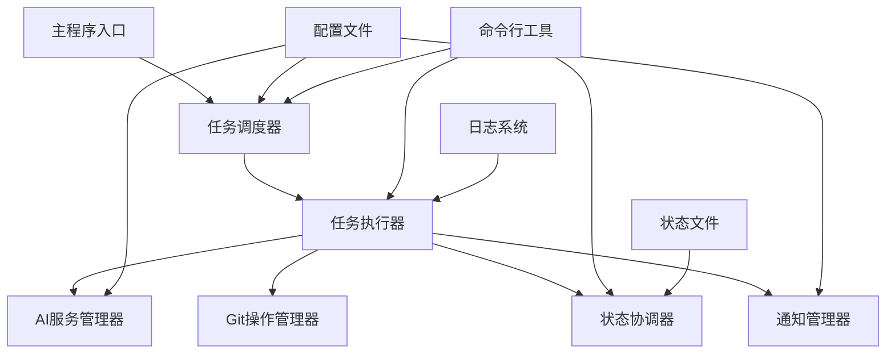

# 自动化AI任务执行系统设计文档

## 1. 系统架构概述

### 1.1 整体架构


### 1.2 核心组件
- **任务调度器**：基于crontab表达式的定时任务调度
- **任务执行器**：执行编码、走查、文档生成任务
- **AI服务管理器**：管理Claude和DeepSeek API调用
- **Git操作管理器**：处理GitHub和GitLab操作
- **状态协调器**：协调编码者和走查者的交替执行
- **通知管理器**：钉钉机器人通知
- **配置管理器**：管理全局和任务级配置

## 2. 系统设计

### 2.1 目录结构
```
auto-coder/
├── src/
│   ├── core/                 # 核心模块
│   │   ├── scheduler.py      # 任务调度器
│   │   ├── executor.py       # 任务执行器
│   │   ├── state_manager.py  # 状态协调器
│   │   └── config_manager.py # 配置管理器
│   ├── services/             # 服务层
│   │   ├── ai_service.py     # AI服务管理
│   │   ├── git_service.py    # Git操作服务
│   │   └── notify_service.py # 通知服务
│   ├── tasks/                # 任务类型
│   │   ├── coding_task.py    # 编码任务
│   │   ├── review_task.py    # 走查任务
│   │   └── doc_task.py       # 文档任务
│   ├── utils/                # 工具类
│   │   ├── logger.py         # 日志工具
│   │   ├── file_utils.py     # 文件操作工具
│   │   └── crypto_utils.py   # 加密工具
│   └── cli/                  # 命令行接口
│       └── main.py           # 主程序入口
├── config/                   # 配置文件
│   ├── global_config.yaml    # 全局配置
│   └── tasks/                # 任务配置
├── logs/                     # 日志文件
├── states/                   # 状态文件
├── outputs/                  # 输出文件
├── requirements.txt           # 依赖包
├── README.md                 # 使用说明
└── run.py                    # 启动脚本
```

### 2.2 配置文件结构

#### 全局配置文件 (global_config.yaml)
```yaml
# AI服务配置
ai_services:
  claude:
    api_key: "${CLAUDE_API_KEY}"
    base_url: "https://api.anthropic.com"
    model: "claude-3-sonnet-20240229"
    max_tokens: 4000
    temperature: 0.1
  
  deepseek:
    api_key: "${DEEPSEEK_API_KEY}"
    base_url: "https://api.deepseek.com"
    model: "deepseek-coder"
    max_tokens: 4000
    temperature: 0.1

# Git配置
git:
  github:
    token: "${GITHUB_TOKEN}"
    username: "${GITHUB_USERNAME}"
  gitlab:
    token: "${GITLAB_TOKEN}"
    base_url: "${GITLAB_BASE_URL}"

# 通知配置
notification:
  dingtalk:
    webhook_url: "${DINGTALK_WEBHOOK}"
    secret: "${DINGTALK_SECRET}"
    at_users: ["张三", "李四"]

# 日志配置
logging:
  level: "INFO"
  retention_days: 30
  max_file_size: "10MB"

# 系统配置
system:
  work_dir: "./states"
  output_dir: "./outputs"
  max_concurrent_tasks: 5
  default_timeout: 300
```

#### 任务配置文件示例 (tasks/coding_task.yaml)
```yaml
task_id: "feature_001"
name: "用户管理功能开发"
type: "coding"
priority: 1
enabled: true

# 调度配置
schedule:
  cron_expressions:
    - "0 9 * * *"      # 每天9点执行
    - "0 18 * * *"     # 每天18点执行

# 项目配置
project:
  name: "user-management"
  path: "D:/projects/user-management"
  branch: "feature/user-management"
  base_branch: "main"
  git_platform: "github"

# AI配置
ai:
  primary_model: "claude"
  fallback_model: "deepseek"
  coding_prompt: "开发用户管理功能，包括用户增删改查"
  review_prompt: "根据公司编码规范审查代码"

# 输出配置
output:
  review_output: "./outputs/reviews"
  doc_output: "./outputs/docs"
  log_output: "./logs"

# 通知配置
notify:
  on_start: true
  on_complete: true
  on_error: true
  at_users: ["张三"]
```

### 2.3 状态文件结构

#### 任务状态文件 (states/task_001.json)
```json
{
  "task_id": "task_001",
  "task_name": "用户管理功能开发",
  "task_type": "coding",
  "current_state": "coding",
  "status": "running",
  "current_round": 1,
  "max_rounds": 5,
  "start_time": "2025-01-20T09:00:00Z",
  "last_update": "2025-01-20T09:30:00Z",
  
  "coding_state": {
    "status": "completed",
    "start_time": "2025-01-20T09:00:00Z",
    "end_time": "2025-01-20T09:30:00Z",
    "commit_hash": "abc123",
    "files_changed": ["src/UserService.java", "src/UserController.java"]
  },
  
  "review_state": {
    "status": "pending",
    "start_time": null,
    "end_time": null,
    "review_opinions": [],
    "issues_found": 0
  },
  
  "history": [
    {
      "round": 1,
      "state": "coding",
      "timestamp": "2025-01-20T09:00:00Z",
      "details": "开始编码任务"
    }
  ]
}
```

## 3. 核心模块设计

### 3.1 任务调度器 (Scheduler)
```python
class TaskScheduler:
    """任务调度器，基于APScheduler实现"""
    
    def __init__(self, config_manager):
        self.config_manager = config_manager
        self.scheduler = APScheduler()
        self.running_tasks = {}
    
    def start(self):
        """启动调度器"""
        self.scheduler.start()
        self._load_tasks()
    
    def _load_tasks(self):
        """加载所有任务配置"""
        tasks = self.config_manager.get_all_tasks()
        for task in tasks:
            if task.enabled:
                self._schedule_task(task)
    
    def _schedule_task(self, task):
        """调度单个任务"""
        for cron_expr in task.schedule.cron_expressions:
            self.scheduler.add_job(
                func=self._execute_task,
                trigger='cron',
                args=[task.task_id],
                **self._parse_cron(cron_expr)
            )
    
    def _execute_task(self, task_id):
        """执行任务"""
        if self._can_execute_task(task_id):
            executor = TaskExecutor(task_id, self.config_manager)
            executor.start()
```

### 3.2 任务执行器 (Executor)
```python
class TaskExecutor:
    """任务执行器，管理任务的生命周期"""
    
    def __init__(self, task_id, config_manager):
        self.task_id = task_id
        self.config_manager = config_manager
        self.task_config = config_manager.get_task_config(task_id)
        self.state_manager = StateManager(task_id)
        self.ai_service = AIService()
        self.git_service = GitService()
        self.notify_service = NotifyService()
    
    def start(self):
        """开始执行任务"""
        try:
            self.notify_service.notify_task_start(self.task_config)
            self._execute_task_logic()
        except Exception as e:
            self._handle_error(e)
    
    def _execute_task_logic(self):
        """执行任务逻辑"""
        if self.task_config.type == "coding":
            self._execute_coding_task()
        elif self.task_config.type == "review":
            self._execute_review_task()
        elif self.task_config.type == "doc":
            self._execute_doc_task()
    
    def _execute_coding_task(self):
        """执行编码任务"""
        coding_task = CodingTask(self.task_config, self.ai_service, self.git_service)
        coding_task.execute()
```

### 3.3 状态协调器 (StateManager)
```python
class StateManager:
    """状态协调器，管理任务状态转换"""
    
    def __init__(self, task_id):
        self.task_id = task_id
        self.state_file = f"states/{task_id}.json"
        self.lock = threading.Lock()
    
    def get_current_state(self):
        """获取当前状态"""
        with self.lock:
            if os.path.exists(self.state_file):
                with open(self.state_file, 'r', encoding='utf-8') as f:
                    return json.load(f)
            return self._create_initial_state()
    
    def update_state(self, new_state, details=None):
        """更新状态"""
        with self.lock:
            current_state = self.get_current_state()
            current_state.update(new_state)
            current_state['last_update'] = datetime.utcnow().isoformat()
            
            if details:
                current_state['history'].append({
                    'round': current_state.get('current_round', 1),
                    'state': new_state.get('current_state'),
                    'timestamp': datetime.utcnow().isoformat(),
                    'details': details
                })
            
            self._save_state(current_state)
    
    def transition_to_state(self, target_state):
        """状态转换"""
        current_state = self.get_current_state()
        if target_state == "reviewing" and current_state['current_state'] == "coding":
            self.update_state({
                'current_state': 'reviewing',
                'coding_state': {'status': 'completed', 'end_time': datetime.utcnow().isoformat()}
            })
        elif target_state == "coding" and current_state['current_state'] == "reviewing":
            self.update_state({
                'current_state': 'coding',
                'current_round': current_state.get('current_round', 1) + 1,
                'review_state': {'status': 'completed', 'end_time': datetime.utcnow().isoformat()}
            })
```

## 4. 任务类型实现

### 4.1 编码任务 (CodingTask)
```python
class CodingTask:
    """编码任务实现"""
    
    def __init__(self, config, ai_service, git_service):
        self.config = config
        self.ai_service = ai_service
        self.git_service = git_service
        self.state_manager = StateManager(config.task_id)
    
    def execute(self):
        """执行编码任务"""
        try:
            # 1. 准备开发环境
            self._prepare_environment()
            
            # 2. 生成代码
            code_changes = self._generate_code()
            
            # 3. 应用代码变更
            self._apply_code_changes(code_changes)
            
            # 4. 提交代码
            commit_hash = self._commit_code()
            
            # 5. 更新状态为走查
            self.state_manager.transition_to_state("reviewing")
            
            # 6. 通知走查者
            self._notify_reviewer()
            
        except Exception as e:
            self._handle_error(e)
    
    def _generate_code(self):
        """使用AI生成代码"""
        prompt = self._build_coding_prompt()
        response = self.ai_service.generate_code(
            model=self.config.ai.primary_model,
            prompt=prompt,
            context=self._get_code_context()
        )
        return self._parse_code_response(response)
    
    def _apply_code_changes(self, changes):
        """应用代码变更"""
        for file_path, content in changes.items():
            full_path = os.path.join(self.config.project.path, file_path)
            os.makedirs(os.path.dirname(full_path), exist_ok=True)
            with open(full_path, 'w', encoding='utf-8') as f:
                f.write(content)
```

### 4.2 走查任务 (ReviewTask)
```python
class ReviewTask:
    """走查任务实现"""
    
    def __init__(self, config, ai_service, git_service):
        self.config = config
        self.ai_service = ai_service
        self.git_service = git_service
        self.state_manager = StateManager(config.task_id)
    
    def execute(self):
        """执行走查任务"""
        try:
            # 1. 获取代码变更
            changes = self._get_code_changes()
            
            # 2. 分析代码质量
            review_result = self._review_code(changes)
            
            # 3. 生成走查意见
            opinions = self._generate_review_opinions(review_result)
            
            # 4. 输出走查报告
            self._output_review_report(opinions)
            
            # 5. 判断是否需要继续编码
            if self._has_critical_issues(opinions):
                self.state_manager.transition_to_state("coding")
            else:
                self._complete_task()
                
        except Exception as e:
            self._handle_error(e)
    
    def _get_code_changes(self):
        """获取代码变更"""
        if self.config.is_collaborative:
            # 协作模式：获取编码任务的变更
            return self._get_collaborative_changes()
        else:
            # 独立模式：获取指定分支的变更
            return self._get_branch_changes()
    
    def _review_code(self, changes):
        """AI代码审查"""
        prompt = self._build_review_prompt(changes)
        response = self.ai_service.review_code(
            model=self.config.ai.primary_model,
            prompt=prompt,
            code_changes=changes,
            coding_standards=self._load_coding_standards()
        )
        return self._parse_review_response(response)
```

## 5. 服务层设计

### 5.1 AI服务管理器 (AIService)
```python
class AIService:
    """AI服务管理器，支持多个AI模型"""
    
    def __init__(self, config):
        self.config = config
        self.clients = self._initialize_clients()
    
    def _initialize_clients(self):
        """初始化AI客户端"""
        clients = {}
        
        # Claude客户端
        if self.config.ai_services.claude.api_key:
            clients['claude'] = ClaudeClient(
                api_key=self.config.ai_services.claude.api_key,
                base_url=self.config.ai_services.claude.base_url,
                model=self.config.ai_services.claude.model
            )
        
        # DeepSeek客户端
        if self.config.ai_services.deepseek.api_key:
            clients['deepseek'] = DeepSeekClient(
                api_key=self.config.ai_services.deepseek.api_key,
                base_url=self.config.ai_services.deepseek.base_url,
                model=self.config.ai_services.deepseek.model
            )
        
        return clients
    
    def generate_code(self, model, prompt, context=None):
        """生成代码"""
        client = self.clients.get(model)
        if not client:
            raise ValueError(f"Unsupported AI model: {model}")
        
        try:
            response = client.generate_code(prompt, context)
            return response
        except Exception as e:
            # 尝试使用备用模型
            fallback_model = self._get_fallback_model(model)
            if fallback_model and fallback_model != model:
                return self.generate_code(fallback_model, prompt, context)
            raise e
    
    def review_code(self, model, prompt, code_changes, coding_standards):
        """代码审查"""
        client = self.clients.get(model)
        if not client:
            raise ValueError(f"Unsupported AI model: {model}")
        
        return client.review_code(prompt, code_changes, coding_standards)
```

### 5.2 Git操作服务 (GitService)
```python
class GitService:
    """Git操作服务，支持GitHub和GitLab"""
    
    def __init__(self, config):
        self.config = config
        self.github_client = self._init_github_client()
        self.gitlab_client = self._init_gitlab_client()
    
    def _init_github_client(self):
        """初始化GitHub客户端"""
        if self.config.git.github.token:
            return Github(self.config.git.github.token)
        return None
    
    def _init_gitlab_client(self):
        """初始化GitLab客户端"""
        if self.config.git.gitlab.token:
            return gitlab.Gitlab(
                url=self.config.git.gitlab.base_url,
                private_token=self.config.git.gitlab.token
            )
        return None
    
    def create_branch(self, project_path, base_branch, new_branch):
        """创建新分支"""
        repo = git.Repo(project_path)
        
        # 确保本地是最新的
        repo.remotes.origin.fetch()
        
        # 创建新分支
        new_branch_ref = repo.create_head(new_branch, f"origin/{base_branch}")
        new_branch_ref.checkout()
        
        return new_branch_ref
    
    def commit_changes(self, project_path, commit_message, files=None):
        """提交代码变更"""
        repo = git.Repo(project_path)
        
        # 添加所有变更
        if files:
            for file_path in files:
                repo.index.add([file_path])
        else:
            repo.index.add(['*'])
        
        # 提交
        commit = repo.index.commit(commit_message)
        
        # 推送到远程
        repo.remotes.origin.push()
        
        return commit.hexsha
    
    def get_changes_since(self, project_path, branch, since_date):
        """获取指定时间之后的代码变更"""
        repo = git.Repo(project_path)
        
        # 获取指定分支
        branch_ref = repo.heads[branch]
        branch_ref.checkout()
        
        # 获取指定时间之后的提交
        since_timestamp = datetime.strptime(since_date, "%Y-%m-%d").timestamp()
        commits = []
        
        for commit in repo.iter_commits(branch):
            if commit.committed_date >= since_timestamp:
                commits.append({
                    'hash': commit.hexsha,
                    'author': commit.author.name,
                    'date': datetime.fromtimestamp(commit.committed_date),
                    'message': commit.message,
                    'files': list(commit.stats.files.keys())
                })
        
        return commits
```

## 6. 命令行接口设计

### 6.1 主程序入口 (main.py)
```python
import click
import yaml
import json
from pathlib import Path

@click.group()
def cli():
    """自动化AI任务执行系统"""
    pass

@cli.command()
@click.option('--config', '-c', default='config/global_config.yaml', help='配置文件路径')
@click.option('--daemon', '-d', is_flag=True, help='以守护进程模式运行')
def start(config, daemon):
    """启动任务调度器"""
    click.echo(f"启动任务调度器，配置文件: {config}")
    
    # 加载配置
    config_manager = ConfigManager(config)
    
    # 启动调度器
    scheduler = TaskScheduler(config_manager)
    scheduler.start()
    
    if daemon:
        click.echo("以守护进程模式运行...")
        # 实现守护进程逻辑
    else:
        click.echo("按 Ctrl+C 停止...")
        try:
            scheduler.wait()
        except KeyboardInterrupt:
            click.echo("正在停止...")
            scheduler.stop()

@cli.command()
@click.argument('task_id')
def status(task_id):
    """查看任务状态"""
    state_file = Path(f"states/{task_id}.json")
    if state_file.exists():
        with open(state_file, 'r', encoding='utf-8') as f:
            state = json.load(f)
        
        click.echo(f"任务ID: {state['task_id']}")
        click.echo(f"任务名称: {state['task_name']}")
        click.echo(f"当前状态: {state['current_state']}")
        click.echo(f"状态: {state['status']}")
        click.echo(f"当前轮次: {state['current_round']}")
        click.echo(f"最后更新: {state['last_update']}")
    else:
        click.echo(f"任务 {task_id} 不存在")

@cli.command()
@click.argument('task_id')
def trigger(task_id):
    """手动触发任务"""
    click.echo(f"手动触发任务: {task_id}")
    
    # 获取任务配置
    config_manager = ConfigManager()
    task_config = config_manager.get_task_config(task_id)
    
    if task_config:
        # 创建执行器并执行
        executor = TaskExecutor(task_id, config_manager)
        executor.start()
        click.echo("任务已触发")
    else:
        click.echo(f"任务 {task_id} 配置不存在")

@cli.command()
@click.argument('task_id')
def stop(task_id):
    """停止正在执行的任务"""
    click.echo(f"停止任务: {task_id}")
    
    # 实现任务停止逻辑
    state_manager = StateManager(task_id)
    state_manager.update_state({'status': 'stopped'})
    click.echo("任务已停止")

@cli.command()
def list():
    """列出所有任务"""
    config_dir = Path("config/tasks")
    if config_dir.exists():
        for config_file in config_dir.glob("*.yaml"):
            with open(config_file, 'r', encoding='utf-8') as f:
                config = yaml.safe_load(f)
            
            click.echo(f"任务ID: {config.get('task_id', 'N/A')}")
            click.echo(f"任务名称: {config.get('name', 'N/A')}")
            click.echo(f"任务类型: {config.get('type', 'N/A')}")
            click.echo(f"启用状态: {config.get('enabled', False)}")
            click.echo("---")
    else:
        click.echo("没有找到任务配置文件")

if __name__ == '__main__':
    cli()
```

## 7. 部署和运行

### 7.1 依赖安装
```bash
# 安装Python依赖
pip install -r requirements.txt

# 安装Git客户端（Windows）
# 下载并安装 Git for Windows
```

### 7.2 环境变量配置
```bash
# 设置环境变量
set CLAUDE_API_KEY=your_claude_api_key
set DEEPSEEK_API_KEY=your_deepseek_api_key
set GITHUB_TOKEN=your_github_token
set GITHUB_USERNAME=your_github_username
set GITLAB_TOKEN=your_gitlab_token
set GITLAB_BASE_URL=your_gitlab_url
set DINGTALK_WEBHOOK=your_dingtalk_webhook
set DINGTALK_SECRET=your_dingtalk_secret
```

### 7.3 启动系统
```bash
# 启动任务调度器
python src/cli/main.py start

# 查看任务状态
python src/cli/main.py status task_001

# 手动触发任务
python src/cli/main.py trigger task_001

# 列出所有任务
python src/cli/main.py list
```

## 8. 监控和日志

### 8.1 日志格式
```
2025-01-20 09:00:00,123 - INFO - [TaskExecutor] 开始执行任务: task_001
2025-01-20 09:00:05,456 - INFO - [CodingTask] 代码生成完成，文件数: 3
2025-01-20 09:00:10,789 - INFO - [GitService] 代码提交成功，commit: abc123
2025-01-20 09:00:11,012 - INFO - [StateManager] 状态更新: coding -> reviewing
```

### 8.2 监控指标
- 任务执行成功率
- 任务执行时间
- AI API调用次数和成功率
- Git操作成功率
- 系统资源使用情况

## 9. 安全考虑

### 9.1 API密钥管理
- 使用环境变量存储敏感信息
- 日志中自动脱敏API密钥
- 支持密钥轮换

### 9.2 访问控制
- Git操作使用最小权限原则
- 支持SSH密钥认证
- 操作审计日志

## 10. 扩展性设计

### 10.1 新AI模型支持
- 插件化的AI服务接口
- 配置文件驱动的模型选择
- 支持自定义AI服务

### 10.2 新任务类型
- 基于接口的任务类型定义
- 插件化的任务实现
- 支持自定义任务逻辑

## 11. 总结

本设计文档详细描述了自动化AI任务执行系统的架构设计、核心模块、配置管理、部署运行等各个方面。系统采用模块化设计，具有良好的扩展性和维护性，能够满足编码、走查、文档生成等多种自动化任务需求。

系统的主要特点：
1. **灵活的调度机制**：支持crontab表达式的定时任务执行
2. **智能的状态协调**：通过状态文件实现编码者和走查者的协作
3. **多AI模型支持**：支持Claude和DeepSeek等多种AI模型
4. **完整的Git集成**：支持GitHub和GitLab的自动化操作
5. **丰富的通知机制**：支持钉钉机器人通知
6. **友好的命令行接口**：提供完整的任务管理功能

通过这个系统，用户可以自动化地完成代码开发、代码审查、文档生成等任务，大大提高开发效率和代码质量。
